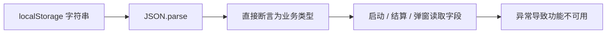

# Dashline 代码审计报告

> 审计日期：2026-09-04
>
> 审计类型：白盒、离线优先的源码与构建审计
>
> 报告结构：`flavor = null`（通用代码审计，不套用恶意软件或 APT 模板）
>
> 范围与授权：[scope.md](../work/dashline-code-audit/scope.md)
>
> 时间线：[timeline.md](../work/dashline-code-audit/timeline.md)

## 1. 执行摘要

本次审计覆盖 `packages/shared`、`packages/core`、`apps/client`、测试、构建与发布脚本。未发现远程 API、账号、WebSocket、遥测、动态代码执行或可由远程输入直接触发的 DOM 注入；纯单机产品边界总体保持良好。核心测试、全仓 TypeScript 检查、生产构建和现有浏览器流程均能执行成功。

初始审计确认 6 项中风险和 5 项低风险。本轮已完成 11 项修复并通过 53 个单元/回归测试、全仓 TypeScript 检查、生产构建和真实 Chromium 验收。修复覆盖 localStorage 校验与迁移、连续完赛语义、严格 E2E、可提交 CI、统一 tick 常量、受保护的手工发布、跨引擎确定性、道具索引、结算距离、暂停状态机和帧率无关动画。依赖漏洞查询仍因 npm registry 无响应而未完成，不能据此宣称依赖无已知漏洞。

## 2. 范围与威胁模型

| 项目 | 内容 |
|---|---|
| 范围 | TypeScript 源码、静态客户端、确定性核心、localStorage、测试、构建与发布脚本 |
| 不在范围 | 无关的鱼吃鱼设计稿、业务源码修复、外部目标扫描、部署与发布 |
| 信任边界 | 浏览器输入事件、localStorage、静态资源加载、开发/发布命令 |
| 高价值属性 | 每日赛道确定性、进度可恢复性、结算正确性、测试可信度、发布目标完整性 |
| 外部攻击面 | 当前产品无后端与远程业务接口；主要风险是本机数据损坏、同源脚本影响与维护操作失误 |

本次没有鉴权、多租户、服务端反序列化、SSRF、文件上传、SQL/命令注入等适用入口。HUD 虽使用 `innerHTML`，但当前插值来源是代码内静态定义和数值状态，未发现远程可控字符串到危险 DOM sink 的数据流。

## 3. 发现汇总

| ID | 等级 | 结论 | 状态 |
|---|---|---|---|
| F-001 | 中 | localStorage 解析结果无运行时校验，可导致启动或界面崩溃 | 已修复并验证 |
| F-002 | 中 | 失败记录也被计为“连胜”，且历史尝试次数只随最高分更新 | 已修复并验证 |
| F-003 | 中 | 浏览器测试可在 HUD 未就绪、存在警告或断言为 false 时仍报告成功 | 已修复并验证 |
| F-004 | 中 | `.github/` 被整体忽略，仓库声称存在的 Pages CI 实际不可提交 | 已修复并验证 |
| F-005 | 中 | 客户端重复硬编码 `1/60`，破坏 tick 频率的单一事实源 | 已修复并验证 |
| F-006 | 中 | 手工部署脚本向固定远端执行 `--force` 推送，缺少目标保护 | 已修复并验证 |
| F-007 | 低 | 确定性 core 使用 `Math.sin` 生成影响计分的金币位置 | 已修复并验证 |
| F-008 | 低 | 多个护盾/磁铁道具只会隐藏索引 0 的渲染对象 | 已修复并验证 |
| F-009 | 低 | 撞毁面板用 score 推算距离，金币会扭曲显示结果 | 已修复并验证 |
| F-010 | 低 | 暂停提示与按键行为不一致，弹窗关闭后可能残留暂停 UI | 已修复并验证 |
| F-011 | 低 | 部分视觉动画按帧累加，表现随刷新率变化并可能漂移 | 已修复并验证 |

## 4. 详细发现

以下 `status: validated` 记录发现被确认时的审计结论；当前修复状态及验证证据见本节末尾“修复验证矩阵”。

### F-001：localStorage 数据损坏可使客户端不可用

- severity: medium
- category: design
- status: validated
- evidence_ids: [E-004, E-008]
- location: `apps/client/src/meta.ts:25`、`apps/client/src/talents.ts:68`、`apps/client/src/achievements.ts:63`、`apps/client/src/wardrobe.ts:76`
- confidence: high
- impact: localStorage 中合法 JSON 但结构错误（例如 `null`）会绕过 `try/catch`，随后在 `calculateStreak()`、`getPerksConfig()` 或 `getAll()` 中抛异常。`dl_history_v1` 或 `dl_talents` 损坏时可直接阻断启动。
- repro_steps:
  1. 将 `dl_history_v1`、`dl_talents` 或 `dl_achievements` 写为字符串 `null`。
  2. 刷新页面或打开相应面板。
  3. 观察 `Cannot read properties of null`。
- remediation: 所有模块统一使用 `storage.ts`；增加版本化 key、逐字段校验、有限数值检查和默认值迁移。不要用 TypeScript 类型断言替代运行时验证。

### F-002：历史、连胜和成就语义不一致

- severity: medium
- category: other
- status: validated
- evidence_ids: [E-003, E-005]
- location: `apps/client/src/meta.ts:33`、`apps/client/src/meta.ts:43`、`apps/client/src/main.ts:279`、`apps/client/src/main.ts:450`
- confidence: high
- impact: `calculateStreak()` 只检查日期键是否存在，不检查 `finished`；因此每天撞毁一次也能累计“连胜”。`streak_7` 的文案要求连续完赛，但逻辑可由失败记录满足。此外，`saveDayRecord()` 仅在分数提高时写入，较低分的后续尝试不会更新 `attempts`。
- repro_steps:
  1. 写入连续七天、`finished:false` 的记录。
  2. 调用 `calculateStreak('2026-08-07')`，返回 7。
  3. 同日再写低分且 `attempts:2` 的记录，读取结果仍为 `attempts:1`。
- remediation: 明确产品要的是“参与天数”还是“完赛连胜”。若保留连胜命名，应仅统计 `finished === true`；将每日最佳与每日统计拆开，最佳字段按成绩更新，`attempts/updatedAt` 每局更新。完赛后先提交记录、重算 streak，再检查 `streak_7`。

### F-003：浏览器测试存在系统性假阳性

- severity: medium
- category: design
- status: validated
- evidence_ids: [E-003, E-008]
- location: `scripts/browser-human-test.ts:66`、`scripts/browser-human-test.ts:74`、`scripts/browser-human-test.ts:167`、`scripts/browser-human-test.ts:189`
- confidence: high
- impact: `pageerror` 和控制台错误只记录、不使测试失败；暂停状态只打印布尔值；页面仅等待 canvas，而 canvas 在资源加载和 `resetAttempt()` 前已插入。本次运行的初始 HUD 为空且 PixiJS 发出弃用警告，脚本仍打印“100% 成功”。客户端回归可能被 CI 或人工验收漏掉。
- repro_steps:
  1. 运行 `pnpm test:browser`。
  2. 观察初始 HUD 输出为空、控制台存在 PixiJS deprecation warning。
  3. 脚本仍以成功状态结束。
- remediation: 等待明确的应用 ready 标记或非空 HUD；收集 `pageerror`、error 级 console 和 failed request，在结束前统一断言；对 `isPaused`、重开后的 attempts、弹窗可见性使用硬断言；移除固定截图路径并使用临时目录或可配置输出目录。

### F-004：CI 工作流被 `.gitignore` 排除

- severity: medium
- category: misconfig
- status: validated
- evidence_ids: [E-006]
- location: `.gitignore:9`、`.github/workflows/deploy.yml:1`、`HANDOVER.md:42`
- confidence: high
- impact: `.github/` 整体被忽略，`deploy.yml` 不在 Git 索引中。新克隆或远端仓库不会获得该工作流，与 HANDOVER 中“main 更新时运行测试并部署”的描述冲突。
- repro_steps:
  1. 运行 `git check-ignore -v .github/workflows/deploy.yml`。
  2. 运行 `git ls-files --error-unmatch .github/workflows/deploy.yml`。
  3. 前者命中 `.gitignore:9`，后者显示未跟踪。
- remediation: 删除过宽的 `.github/` 忽略项，显式提交工作流；CI 中补充 `pnpm -r exec tsc --noEmit`，并在可用环境运行浏览器验收。

### F-005：固定步长存在两个事实源

- severity: medium
- category: design
- status: validated
- evidence_ids: [E-008]
- location: `packages/shared/src/constants.ts:2`、`apps/client/src/main.ts:29`
- confidence: high
- impact: shared 声明 `TICK_RATE/STEP_S` 是全项目唯一时间真相，但主循环另写 `const STEP_S = 1 / 60`。未来调整 tick rate 时，core 的单步时长和客户端每秒执行步数会分离，导致游戏速度、计时和物理不一致。
- repro_steps:
  1. 搜索 `STEP_S` 定义。
  2. 对比 shared 的派生常量与 main 的硬编码。
- remediation: 客户端从 `@dashline/shared` 导入 `STEP_S`。同时删除或统一使用当前未被消费的 `DASH_DURATION_TICKS`，避免冲刺持续时间继续出现重复定义。

### F-006：手工部署命令可强制覆盖固定远端分支

- severity: medium
- category: misconfig
- status: validated
- evidence_ids: [E-008]
- location: `scripts/deploy-pages.ts:11`、`scripts/deploy-pages.ts:37`、`scripts/deploy-pages.ps1:6`、`scripts/deploy-pages.ps1:22`
- confidence: high
- impact: 两套脚本都把远端固定为 `mmuu1987/dashline.git`，并从新初始化的临时仓库向 `gh-pages` 执行强制推送。仓库被 fork、迁移或复用后，有相应凭据的维护者可能覆盖错误目标；脚本也绕开了现有 Pages Actions 发布链路。
- repro_steps:
  1. 静态检查 `repoUrl/$repo` 与 `git push origin gh-pages --force`。
  2. 对比当前 Git remote 和工作流发布方式。
- remediation: 默认从当前仓库 remote 推导目标并校验 owner/repo；要求显式 `--target` 和确认标志才允许 force push；优先保留单一的 GitHub Pages Actions 发布路径。Node 脚本使用参数数组调用进程，避免字符串 shell。

### F-007：core 中三角函数削弱跨引擎逐位确定性

- severity: low
- category: design
- status: validated
- evidence_ids: [E-008]
- location: `packages/core/src/chunks.ts:214`、`packages/core/src/chunks.ts:304`、`packages/core/src/chunks.ts:502`
- confidence: high
- impact: core 自身注释已经指出 `Math.sin` 的实现差异会破坏跨引擎逐位一致，但三个积木仍用它确定金币 y 坐标。金币位置影响拾取和得分，极端边界输入下可能造成引擎间结果分歧。现有测试只在同一 JS 引擎内重复运行，没有 golden snapshot 或跨引擎验证。
- repro_steps:
  1. 搜索 core 中的 `Math.sin`。
  2. 对比 `tuning.ts` 对跨引擎三角函数的限制说明。
- remediation: 使用固定表、整数/有理插值或与 mover 相同的分段纯函数生成弧线；为代表性种子增加序列化 golden fixture，并至少在两种 JS 引擎验证。

### F-008：多道具赛道的视觉状态与 core 状态不一致

- severity: low
- category: other
- status: validated
- evidence_ids: [E-007, E-008]
- location: `packages/core/src/world.ts:73`、`apps/client/src/main.ts:406`、`apps/client/src/main.ts:421`、`apps/client/src/render/worldview.ts:457`
- confidence: high
- impact: `shield`、`magnet` 事件不带索引，客户端固定调用 `view.onShield(0)` / `view.onMagnet(0)`。生成器可产生多个同类道具（例如 seed 6 有两个 shield），第二个及后续道具被拾取后仍显示在场景中。
- repro_steps:
  1. 用 `buildTrack(6n)` 确认 `shields.length === 2`。
  2. 对比事件结构和 main 的固定索引调用。
- remediation: 事件携带道具索引，并在 snapshot 中公开已拾取索引作为重建兜底；渲染层按真实索引隐藏。

### F-009：撞毁结果中的距离计算错误

- severity: low
- category: other
- status: validated
- evidence_ids: [E-008]
- location: `apps/client/src/hud.ts:75`、`packages/core/src/world.ts:208`、`packages/core/src/world.ts:604`
- confidence: high
- impact: core 的距离是 `floor(x/25)`，HUD 却用 `floor(score/100)`；score 还包含宝石加分。因此结算面板显示的“距离”既比例错误，也会随收集数变化。
- remediation: `ResultData` 增加 `distanceM` 并直接显示 snapshot 的距离。

### F-010：暂停状态机与文案不一致

- severity: low
- category: other
- status: validated
- evidence_ids: [E-008]
- location: `apps/client/index.html:184`、`apps/client/src/input.ts:33`、`apps/client/src/main.ts:102`、`apps/client/src/main.ts:125`
- confidence: high
- impact: UI 提示“按 P / 空格继续”，但空格只进入 action handler，暂停时不会恢复，且会留下待消费的 jump press。暂停后打开功能弹窗再关闭时，`exitModal()` 把 phase 改回 run，却不清除暂停徽章或恢复按钮图标。
- remediation: 把暂停恢复动作显式建模；暂停时空格只恢复且清空输入边沿；弹窗退出统一同步 phase、badge、按钮和 accumulator。

### F-011：视觉动画依赖帧率并可能累计漂移

- severity: low
- category: other
- status: validated
- evidence_ids: [E-008]
- location: `apps/client/src/render/worldview.ts:582`、`apps/client/src/render/worldview.ts:604`
- confidence: high
- impact: 金币用 `s.y += sin(...) * 0.18` 每帧累加，护盾用固定 `rotation += 0.04`。高刷新率、低刷新率和不稳定帧率下表现不同；金币位置没有锚定初始 y，可能产生视觉漂移。
- remediation: 动画位置和旋转应是 `tSec` 与静态基准的函数，或使用乘以 `dt` 的增量。

### 修复验证矩阵

| Finding | 修复内容 | 验证证据 |
|---|---|---|
| F-001 | 存档统一经 `storage.ts` 读取；复杂数据逐字段归一化；天赋、成就、衣橱、静音和每日最佳迁移到版本化 key | E-010、E-012 |
| F-002 | streak 仅统计 `finished:true`；低分局仍合并 attempts/updatedAt；完赛提交先于七日成就判断 | E-010、E-011 |
| F-003 | E2E 等待 ready 标记；页面异常、控制台警告/错误、请求失败和 UI 状态均成为硬断言；截图改为临时或可配置目录 | E-011 |
| F-004 | 移除 `.github/` 忽略规则；Pages 工作流增加测试、类型检查、Chromium 安装、浏览器验收与构建 | E-012 |
| F-005 | 主循环导入 shared `STEP_S`；冲刺时长导入 `DASH_DURATION_TICKS` | E-012 |
| F-006 | 两个脚本默认读取当前 `origin`、校验目标、使用参数数组，并要求显式 `--allow-force` / `-AllowForce` | E-012 |
| F-007 | 三处金币弧线改为四则运算抛物线；`CORE_VERSION` 升至 `core.10`；新增固定种子黄金摘要 | E-010、E-012 |
| F-008 | shield/magnet 事件携带真实 index，客户端按 index 隐藏；新增 index 1 回归测试 | E-010 |
| F-009 | 结果数据直接携带并显示 `WorldSnapshot.distanceM` | E-011、E-012 |
| F-010 | 暂停/弹窗保存并恢复来源 phase，清空输入边沿；空格可恢复；E2E 覆盖弹窗返回暂停状态 | E-011 |
| F-011 | 金币 y 与护盾 rotation 改为静态基准和 `tSec` 的纯函数 | E-011、E-012 |

## 5. Evidence

### E-001

- title: 源码与风险入口清点
- observed_at: 2026-09-04
- source_type: command
- source_ref: `rg --files` 与危险 API 搜索
- content_hash: n/a
- artifact_path: n/a
- repro_command: `rg -n "innerHTML|localStorage|fetch\\(|Math\\.random|Date\\.now|performance\\.now|execSync|--force" apps packages scripts`
- raw_excerpt: core 未使用 DOM、网络、localStorage、Date.now 或 Math.random；客户端与脚本存在预期的浏览器/发布 API。
- linked_workitem: WI-001
- supersedes: none

### E-002

- title: 基础工程验证通过
- observed_at: 2026-09-04
- source_type: command
- source_ref: test/typecheck/build
- content_hash: n/a
- artifact_path: n/a
- repro_command: `pnpm test; pnpm -r exec tsc --noEmit; pnpm build`
- raw_excerpt: 6 个测试文件、46 个测试全部通过；TypeScript 退出码 0；Vite 生产构建成功。
- linked_workitem: WI-005
- supersedes: none

### E-003

- title: 浏览器验收存在假阳性信号
- observed_at: 2026-09-04
- source_type: log
- source_ref: `pnpm test:browser`
- content_hash: n/a
- artifact_path: n/a
- repro_command: `pnpm test:browser`
- raw_excerpt: 初始 HUD 为 `""`；PixiJS 报 FillGradient 弃用警告；Node 报 `shell:true` 的 DEP0190 安全警告；脚本最终仍输出“100% 成功”。撞毁后 HUD 显示“1连胜”。
- linked_workitem: WI-003
- supersedes: none

### E-004

- title: 合法但错误结构的本地数据触发异常
- observed_at: 2026-09-04
- source_type: command
- source_ref: tsx 内存 localStorage 复现
- content_hash: n/a
- artifact_path: n/a
- repro_command: `将 dl_achievements、dl_talents、dl_history_v1 依次设为字符串 null，再调用对应 getAll/saveDayRecord；可在浏览器控制台或 tsx mock 中复现。`
- raw_excerpt: `Cannot read properties of null (reading 'first_finish'|'start_shield'|'days')`
- linked_workitem: WI-003
- supersedes: none

### E-005

- title: 失败记录计入 streak 且低分尝试不更新
- observed_at: 2026-09-04
- source_type: command
- source_ref: tsx 内存 localStorage 复现
- content_hash: n/a
- artifact_path: n/a
- repro_command: `连续写入 2026-08-01 至 2026-08-07 的 finished:false 记录后调用 calculateStreak('2026-08-07')；同日再写较低分且 attempts:2 的记录。`
- raw_excerpt: `failed-only streak: 7`；`stored attempts after lower score: 1`
- linked_workitem: WI-003
- supersedes: none

### E-006

- title: GitHub Actions 工作流被忽略
- observed_at: 2026-09-04
- source_type: command
- source_ref: Git 索引检查
- content_hash: n/a
- artifact_path: n/a
- repro_command: `git check-ignore -v .github/workflows/deploy.yml; git ls-files --error-unmatch .github/workflows/deploy.yml`
- raw_excerpt: `.gitignore:9:.github/`；workflow 为 `not-tracked`。
- linked_workitem: WI-004
- supersedes: none

### E-007

- title: 生成器可生成多个同类道具
- observed_at: 2026-09-04
- source_type: command
- source_ref: `buildTrack(6n)`
- content_hash: n/a
- artifact_path: n/a
- repro_command: `pnpm exec tsx -e "import {buildTrack} from './packages/core/src/chunks.ts'; console.log(buildTrack(6n).shields.length)"`
- raw_excerpt: seed 6：`shields = 2`。
- linked_workitem: WI-002
- supersedes: none

### E-008

- title: 人工数据流与状态流审阅
- observed_at: 2026-09-04
- source_type: manual
- source_ref: Findings 中列出的源码行
- content_hash: n/a
- artifact_path: n/a
- repro_command: `rg -n "STEP_S|Math\\.sin|onShield\\(0\\)|onMagnet\\(0\\)|score / 100|--force|空格继续|s\\.y \\+=" apps packages scripts`
- raw_excerpt: 发现重复时间常量、core 三角函数、固定道具索引、错误距离换算、固定远端强推与按帧累加动画。
- linked_workitem: WI-002
- supersedes: none

### E-009

- title: 依赖漏洞查询未完成
- observed_at: 2026-09-04
- source_type: log
- source_ref: `pnpm audit --prod`
- content_hash: n/a
- artifact_path: n/a
- repro_command: `pnpm audit --prod`
- raw_excerpt: npm registry audit endpoint 连续 `ECONNRESET`；重试后人工终止等待。
- linked_workitem: WI-004
- supersedes: none

### E-010

- title: 修复后单元与回归测试通过
- observed_at: 2026-09-04
- source_type: command
- source_ref: `apps/client/test/persistence.test.ts`、`packages/core/test/regressions.test.ts`
- content_hash: n/a
- artifact_path: n/a
- repro_command: `pnpm test`
- raw_excerpt: 8 个测试文件、53 个测试全部通过；新增存档迁移、连续完赛、统计合并、道具 index 与赛道黄金摘要护栏。
- linked_workitem: WI-007
- supersedes: E-002

### E-011

- title: 修复后构建与真实浏览器验收通过
- observed_at: 2026-09-04
- source_type: command
- source_ref: typecheck/build/browser test
- content_hash: n/a
- artifact_path: n/a
- repro_command: `pnpm -r exec tsc --noEmit; pnpm build; pnpm test:browser`
- raw_excerpt: TypeScript 和 Vite 构建退出码 0；Chromium 中初始 HUD 为“尝试 #1”，完整交互流程成功，无控制台 warning/error、pageerror 或 failed request。
- linked_workitem: WI-007
- supersedes: E-003

### E-012

- title: 修复后静态护栏与发布保护复核
- observed_at: 2026-09-04
- source_type: command
- source_ref: 定向 rg、Git ignore 检查与部署拒绝测试
- content_hash: n/a
- artifact_path: n/a
- repro_command: `rg -n "localStorage\\.(getItem|setItem)" apps/client/src --glob "!storage.ts"; rg -n "Math\\.sin\\(" packages/core/src; rg -n "onShield\\(0\\)|onMagnet\\(0\\)|score / 100|mmuu1987|shell:\\s*true" apps packages scripts; git check-ignore .github/workflows/deploy.yml; pnpm pages:deploy`
- raw_excerpt: localStorage 仅由 storage.ts 访问；core 无 Math.sin；旧固定索引、错误距离换算、硬编码远端和 shell:true 均无命中；workflow 不再被忽略；未传确认标志的部署在构建前退出 1。
- linked_workitem: WI-007
- supersedes: E-006, E-008

## 6. Path

### P-001

- title: 本地存档损坏导致启动失败
- path_type: callflow
- start: localStorage 中存在结构错误但语法合法的 JSON
- goal: 阻断游戏启动或相应功能界面
- steps:
  1. `lsGet/localStorage.getItem` 读取字符串 — evidence: E-001 — finding: F-001
  2. `JSON.parse` 后用 `as` 断言，没有 schema 校验 — evidence: E-004 — finding: F-001
  3. `calculateStreak/getPerksConfig/getAll` 解引用错误结构并抛异常 — evidence: E-004 — finding: F-001
- residual_risks: 已通过运行时白名单与数值边界收敛主要风险；localStorage 仍不是防篡改存储，符合纯单机产品边界。

### P-002

- title: 维护者误发布到固定远端
- path_type: callflow
- start: 在 fork、迁移仓库或其他工作副本中运行 `pnpm pages:deploy`
- goal: 固定仓库 `gh-pages` 分支被强制替换
- steps:
  1. 脚本忽略当前 remote，采用硬编码 URL — evidence: E-008 — finding: F-006
  2. 临时目录初始化为全新 `gh-pages` 历史 — evidence: E-008 — finding: F-006
  3. 使用 `git push origin gh-pages --force` 覆盖远端 — evidence: E-008 — finding: F-006
- residual_risks: 强制发布仍会覆盖目标分支，但现在需要显式确认并显示/校验目标；本次修复验证未执行真实部署。

## 7. 验证与限制

| 验证 | 结果 |
|---|---|
| `pnpm test` | 通过，53/53 |
| `pnpm -r exec tsc --noEmit` | 通过 |
| `pnpm build` | 通过 |
| `pnpm test:browser` | 通过；严格断言完整交互、浏览器异常与请求失败；截图写入系统临时目录 |
| 发布保护 | Node 与 PowerShell 脚本未传确认标志时均在构建/推送前退出 1 |
| `git diff --check` | 通过 |
| case traceability | `review_case.py work/dashline-code-audit --strict` 通过：12 Evidence、11 Findings、2 Paths，0 error/warning |
| Semgrep | 本机未安装，使用定向 `rg` 与人工数据流审阅替代 |
| `pnpm audit --prod` | 未完成；首次为 npm registry `ECONNRESET`，修复后重试 30 秒仍无响应并终止 |

客户端持久化与 meta 已有单元回归测试；HUD、InputBuffer 和组合状态机由严格浏览器流程覆盖。跨引擎逐位一致仍只用单引擎黄金摘要近似保护，尚未在第二种 JavaScript 引擎执行同一 fixture。

## 8. 后续工作

1. 网络恢复后重新执行 `pnpm audit --prod`；在拿到成功响应前，将依赖漏洞状态保持为“未验证”。
2. 若后续要求严格跨引擎逐位一致，在 Chromium 之外增加 Firefox/WebKit 或其他 ECMAScript 引擎对同一 golden fixture 的校验。

## 9. 保留的良好实践

- core 没有访问 DOM、BOM、网络、localStorage 或真实时间，也没有使用 `Math.random()`。
- World 把金币、碎裂板、道具等动态状态保存在内部集合/数组中，没有直接修改 Track 的 `got` 字段。
- 主循环使用 accumulator 固定步进并限制单帧追赶上限，避免后台恢复后的超长模拟。
- 构建使用冻结 lockfile；生产应用只加载同源静态资源，没有业务联网。
- 当前代码未发现明文密钥、token、账号体系或远程数据外传逻辑。
