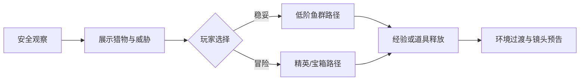

# 内容与关卡设计

## 海域结构

首个海域“珊瑚浅湾”由三个相连分区组成，世界连续滚动，不通过加载页切场。

| 分区 | 进入阶段 | 视觉主题 | 主要教学 | 主要威胁 |
|---|---|---|---|---|
| 阳光礁坪 | 1—2 | 高亮珊瑚、浅蓝水体 | 移动、吞噬、大小关系 | 偶发巡游中型鱼 |
| 海草回廊 | 3—4 | 绿色植被、岩缝 | 同阶战斗、伏击、宝箱 | 领地鱼、毒水母 |
| 沉船暗湾 | 5—6 | 深蓝阴影、沉船轮廓 | 构筑收束、霸主战 | 暗流、精英和首领 |

## 空间语法

关卡由 20—35 秒的遭遇块拼接，每块包含入口安全区、一个主要决策、出口缓冲区。



### 遭遇块规则

- 同一屏最多 1 个高两阶主动追击者。
- 任意位置至少存在一条不经过致命威胁的逃生路径。
- 高价值目标与最近安全区的距离不低于 1.5 个屏幕宽度。
- 连续两个高压块后必须接恢复块或开放空间。
- 玩家进化后的前 6 秒不生成新的高阶伏击者。

## 鱼类梯队

首版鱼种使用原创轮廓和名称。每种鱼只引入一个主要行为差异。

| 鱼种 | 阶级 | AI | 特征 | 基础分 |
|---|---:|---|---|---:|
| 银点鱼苗 | 0 | 鱼群 | 教学猎物 | 8 |
| 泡泡鳀 | 0 | 逃逸 | 急转但速度低 | 12 |
| 珊瑚豆鱼 | 1 | 鱼群 | 密集成群 | 20 |
| 叶尾鱼 | 1 | 伏击 | 静止伪装，受惊逃逸 | 30 |
| 蓝纹梭鱼 | 2 | 逃逸 | 直线高速 | 55 |
| 石甲鱼 | 2 | 领地 | 正面减伤，侧后脆弱 | 70 |
| 灯笼刺鱼 | 3 | 伏击 | 短距离突袭 | 110 |
| 红鳍猎鱼 | 3 | 领地 | 同阶主动咬合 | 130 |
| 旋潮鳐 | 4 | 巡游 | 扇形击退 | 210 |
| 锯吻鲨 | 4 | 领地 | 长前摇直线冲刺 | 260 |
| 墨影乌贼 | 5 | 伏击 | 制造遮蔽区 | 380 |
| 铁背鲸鱼 | 5 | 巡游 | 缓慢、碰撞压迫 | 450 |
| 珠冠鳐王 | 精英 4 | 领地 | 守护宝箱、两次挣脱 | 650 |
| 幽潮鲨 | 精英 5 | 伏击 | 三段巡游与突袭 | 900 |
| 沉船吞潮者 | 霸主 6 | 霸主 | 三阶段终局战 | 1800 |

## 玩家鱼种

玩家鱼种提供开局倾向，不提供永久吞噬等级优势。

| 鱼种 | 解锁条件 | 被动 | 代价 |
|---|---|---|---|
| 橙尾雀鲷 | 默认 | 体力恢复 +10% | 无 |
| 青线梭鱼 | 单局 8 次冲刺吞噬 | 冲刺距离 +12% | 最大生命 -8% |
| 岩鳞鲷 | 承受 10 次伤害并胜利 | 最大生命 +15% | 转向速度 -8% |
| 月影鱼 | 发现全部暗区鱼类 | 脱战隐蔽更快 | 直接吞噬经验 -8% |
| 金斑河豚 | 连食达到 18 | 连食保留时间 +0.4 秒 | 冲刺消耗 +10% |

## 难度曲线

难度按局内时间、玩家阶级和表现三项计算，但不偷偷改变吞噬关系。

```text
压力值 = 时间段压力 + 阶级压力 + 表现修正
表现修正范围 = -10% 到 +12%
```

表现修正只影响鱼群密度、威胁刷新间隔和恢复道具概率；玩家连续两次低生命时提高恢复道具概率，绝不降低敌人伤害来制造不可解释的规则变化。

| 时间 | 压力目标 | 内容节奏 |
|---|---:|---|
| 0:00—0:30 | 20 | 教学与首次进化 |
| 0:30—1:30 | 35 | 第一次追逃反转 |
| 1:30—3:00 | 55 | 同阶战斗与事件 |
| 3:00—4:30 | 72 | 精英、暗流、资源竞争 |
| 4:30—6:00 | 88 | 霸主入场或计分冲刺 |

## 事件池

| 事件 | 时长 | 目的 | 约束 |
|---|---:|---|---|
| 鱼群迁徙 | 18 秒 | 制造高密度连食 | 同时提高边缘威胁提示 |
| 珍珠贝现身 | 25 秒 | 风险收益决策 | 只在中场后出现 |
| 逆向暗流 | 16 秒 | 改变路线选择 | 不与霸主技能重叠 |
| 猎手巡游 | 20 秒 | 生存压力 | 至少提前 3 秒展示方向 |
| 丰食潮 | 15 秒 | 追赶机制 | 低于期望阶级时权重提升 |
| 幽光暗潮 | 20 秒 | 视野挑战 | 同屏高阶鱼数量减一 |

每日海域根据种子生成事件顺序；普通海域从事件池加权抽取，同一事件两局之间可重复但单局内不连续出现。

## 霸主战

“沉船吞潮者”分三阶段：

1. 巡游：直线冲刺两次，撞击沉船后进入破绽。
2. 召群：召唤低阶鱼群补给，同时释放扇形水流。
3. 狂暴：生命低于 35% 后缩短前摇，但每三次攻击出现更长破绽。

玩家不直接削减首领全部生命；先通过躲避令其失衡，再在破绽期吞噬标记肉块。完成三次破绽即获胜，适合单指控制且不要求精确连招。

## 内容制作规范

- 鱼类轮廓在 20% 屏幕亮度下仍可区分。
- 同阶可战目标与高阶危险目标不得只靠颜色区分。
- 每个新鱼种必须有：巡游、转向、受击、咬合/逃逸、死亡/吞噬五类动作反馈。
- 每个分区至少有一处“安全观察窗”，让玩家看见下一阶目标但无法立即交战。
- 内容配置中的随机权重必须为整数，并接受固定种子回放测试。

