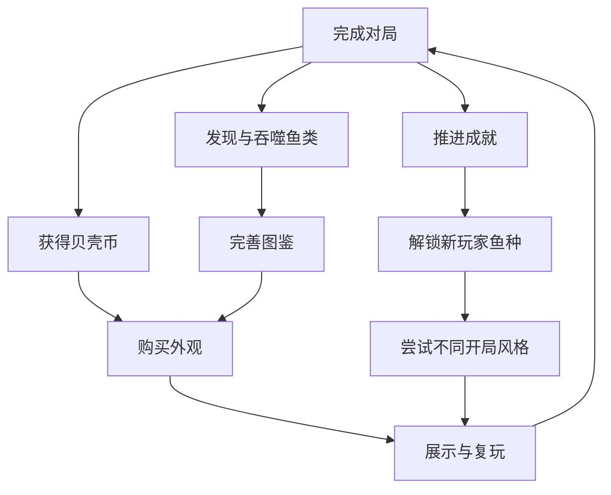

# 成长与经济

## 原则

局外成长提供新选择、收藏和轻量便利，不提高吞噬阶级、不出售直接伤害。游客数据先保存在本地；玩家授权后同步到平台云存档，并以服务端版本号解决覆盖冲突。

## 货币

首版只有一种货币“贝壳币”，降低理解成本。

### 来源

| 来源 | 数量 | 频率 |
|---|---:|---|
| 完成一局 | 20 | 每局 |
| 达到第 4 阶 | 10 | 每局一次 |
| 首次发现鱼种 | 15 | 每鱼种一次 |
| 完成成就 | 30—120 | 一次性 |
| 每日海域首次完成 | 40 | 每日一次，本地日期记录 |

### 消耗

| 消耗项 | 价格 | 规则 |
|---|---:|---|
| 普通皮肤 | 120 | 纯外观 |
| 稀有皮肤 | 280 | 纯外观，需成就前置 |
| 尾迹 | 180 | 纯外观 |
| 吞噬特效 | 220 | 纯外观 |
| 图鉴背景 | 90 | 纯展示 |

预计玩家 4—6 局解锁第一件普通外观，15—20 局获得一件稀有外观。

## 鱼类图鉴

每个条目有四个阶段：未发现、已目击、已吞噬、已精通。

- 已目击：鱼进入玩家有效视野 1 秒。
- 已吞噬：玩家完成一次直接或失衡吞噬。
- 已精通：完成该鱼种的专属行为挑战。
- 图鉴只显示生态说明与玩法提示，不暴露未发现鱼种的完整轮廓。

## 成就

| 成就 | 条件 | 奖励 |
|---|---|---:|
| 初次蜕变 | 首次升到第 2 阶 | 30 |
| 一口不停 | 连食达到 12 | 50 |
| 逆流而上 | 在暗流事件中完成 6 次吞噬 | 60 |
| 大鱼口边 | 被高两阶鱼追击 5 秒后脱离 | 60 |
| 珍珠猎手 | 开启 5 个宝箱贝壳 | 80 |
| 不屈回游 | 复苏后完成海域 | 100 |
| 珊瑚霸主 | 首次击败海域霸主 | 120 |
| 全息生态 | 精通首个海域全部鱼种 | 200 |

成就判定集中在客户端成就模块，通过稳定事件输入更新，避免散落在渲染层。

## 纪录与好友榜

记录以下维度：

- 海域最高分。
- 最快到达第 6 阶时间。
- 单局最高连食。
- 每日海域最近七日结果。
- 各玩家鱼种的最佳成绩。

好友榜只比较同一模式、同一规则版本和同一赛季。百分比必须由真实分布计算；网络不可用时只显示“个人最佳”，不使用模拟排名。

## 解锁路线



## 存档设计

建议使用版本化存档 `tide_hunt_progress_v1`，结构如下：

```typescript
interface OceanProgressV1 {
  version: 1;
  shells: number;
  unlockedFishIds: string[];
  ownedCosmeticIds: string[];
  equipped: {
    fishId: string;
    skinId?: string;
    trailId?: string;
    eatFxId?: string;
  };
  codex: Record<string, {
    seen: boolean;
    eaten: number;
    mastered: boolean;
  }>;
  achievements: Record<string, string>;
  bestByMode: Record<string, {
    score: number;
    maxCombo: number;
    tier6TimeMs?: number;
  }>;
}
```

读取时逐字段补默认值，写入失败只影响进度保存，不阻断本局。结算货币先计算增量再一次性提交，避免刷新页面重复发奖。

## 防刷与公平

为了让好友榜成绩可比较，需要保持最小限度的成绩校验：

- 每日海域纪录绑定战斗规则版本和日期。
- 调试模式运行的成绩不写入正式记录。
- 失焦或暂停期间逻辑 tick 停止，不累计时间与 Buff。
- 存档损坏时备份原字符串到单独错误 key，再创建默认存档。
- 结算上传种子、输入摘要和关键快照哈希；校验失败只拒绝上榜，不没收本地奖励。
