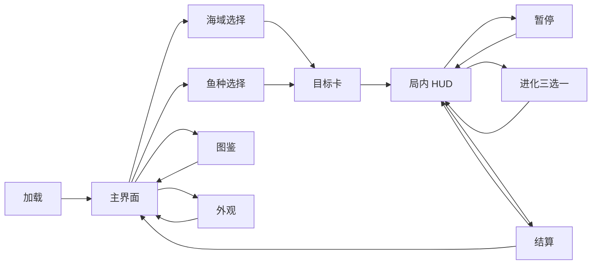

# UI、艺术与音频

## 页面流

## 主界面

- 中央展示当前鱼种的实时游动预览。
- 主按钮“开始回游”占据最大视觉权重。
- 次级入口为海域、图鉴、外观、成就；设置与静音放在角落。
- 显示最近一次个人最佳和今日海域状态，不显示联网排名。
- 首次进入时隐藏复杂入口，只保留开始、设置和图鉴锁定提示。

## 局内 HUD

| 区域 | 内容 | 规则 |
|---|---|---|
| 左上 | 当前阶级、经验环、生命 | 永久显示 |
| 顶中 | 目标进度或剩余时间 | 只显示当前最重要目标 |
| 右上 | 暂停、静音 | 点击区至少 44×44 CSS 像素 |
| 左下 | 动态摇杆 | 触控显示，键鼠隐藏 |
| 右下 | 冲刺、主动技能 | 冷却以环形遮罩显示 |
| 鱼体上方 | 生命/失衡条 | 仅同阶战斗和精英显示 |
| 屏幕边缘 | 高阶威胁箭头 | 进入危险半径才显示 |

经验环在接近升级时变亮，但不持续闪烁。生命低于 25% 时使用低频暗角脉冲和心跳音，不用大面积纯红覆盖遮挡路线。

## 规则可视化

- 可吞噬：目标外沿短暂出现绿色齿形光圈。
- 同阶可战：黄色断续环和失衡图标。
- 不可吞噬：红色尖角轮廓；进入追击范围时显示方向箭头。
- 特殊护甲：灰白盾形标记，侧后方弱点发光。
- 中毒：紫色气泡和计时环，不只改变角色颜色。

色盲模式将绿色/红色关系替换为圆形/三角形轮廓，并提升明度差。

## 结算页

信息顺序：结果标题 → 本局分数 → 新纪录 → 成长摘要 → 死亡/胜利原因 → 操作按钮。

主要按钮：

1. 再来一局。
2. 更换鱼种。
3. 返回主界面。
4. 生成本地战报图。

战报图只包含日期、海域、鱼种、得分、最高连食和个人最佳，不出现在线挑战、排名或二维码。

## 艺术方向

### 视觉风格

- 2.5D 卡通海洋，清晰轮廓、夸张眼神与嘴部动作，弱化写实捕食的不适感。
- 背景采用低对比渐变和大形状，交互实体使用较高饱和度与描边。
- 玩家鱼始终拥有独特的暖色高光；皮肤不得改变敌我识别轮廓。
- 体型进化不仅缩放，还改变鳍、背刺或尾迹，强化阶段感。

### 动画清单

| 动画 | 目标时长 | 关键帧 |
|---|---:|---|
| 巡游摆尾 | 0.7—1.2 秒循环 | 体型越大频率越低 |
| 转向 | 0.18—0.35 秒 | 身体弯曲先于朝向翻转 |
| 冲刺 | 0.4 秒 | 蓄力、拉伸、回稳 |
| 吞噬 | 0.22—0.45 秒 | 张嘴、咬合、满足表情 |
| 受击 | 0.18 秒 | 反向位移与短闪白 |
| 进化 | 0.9 秒 | 吸收、轮廓变化、冲击波 |
| 死亡 | 0.8 秒 | 减速、失色、原因定格 |

## 特效层级

同一时刻按优先级保留：致命威胁 > 受击 > 进化 > 主动技能 > 吞噬 > 普通收集。低优先级特效超过预算时合并粒子，不遮挡危险轮廓。

首版单屏预算：普通粒子 160 个、拖尾 24 条、屏幕闪光每秒最多 2 次、镜头震动连续不超过 0.6 秒。

## 音频设计

### 音乐

- 浅湾：轻快木琴与水泡节奏，90—105 BPM。
- 中段：加入低频鼓点，随压力值分层混入。
- 霸主：保留原调性，节奏加密而非突然切歌。
- 生命低时用低通和心跳，不改变音乐播放速度。

### 音效语义

| 事件 | 音效设计 |
|---|---|
| 可吞噬目标靠近 | 很轻的气泡提示，1 秒内最多一次 |
| 高阶威胁进入 | 低频短促警报，左右声像指向威胁 |
| 连食 | 音高按倍率逐步上升，清零后回落 |
| 进化 | 吸入声、短静音、宽频冲击三段式 |
| 护盾破裂 | 玻璃水泡破裂，与普通受击明显区分 |
| 宝箱开启 | 珍珠滚动与和弦上行 |
| 死亡 | 先压低环境声，再播放原因对应命中声 |

## 无障碍与设置

- 音乐、音效、震动分别开关，并保存在本地。
- 提供色盲轮廓、减少镜头震动、减少闪光、固定摇杆四项设置。
- 所有关键操作可由键盘完成，焦点样式可见。
- 暂停页列出当前控制方式和所有 Buff 的文字说明。
- 页面缩放到 200% 时主要按钮仍可访问，结算信息允许滚动。

