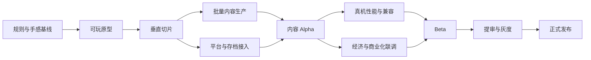

# 《潮汐猎场》开发执行流程

> 本文按 10—12 人核心团队、16 周完成微信小游戏首版的条件拆解。若团队规模低于 8 人，应优先减少鱼种和商业系统，不压缩核心手感、危险反馈与性能验证时间。

## 交付目标

第 16 周交付可提审版本，包含：

- 1 个完整海域、3 个视觉分区、5 种玩家鱼、15 种敌对/生态鱼。
- 6 阶成长、同阶失衡战斗、6 类 AI、7 种道具、宝箱与首领战。
- 新手流程、图鉴、外观、成就、每日海域、好友榜、云存档。
- 激励广告、基础商品、活动配置和最小数据分析。
- 微信小游戏真机性能达标，并具备灰度、回滚和问题追踪能力。

不进入首版：实时 PvP、公会、开放世界、多货币经济、装备强化、UGC 和跨服榜单。

## 团队配置

| 角色 | 人数 | 主要责任 |
|---|---:|---|
| 制作人/主策 | 1 | 范围、优先级、玩法与商业决策 |
| 项目经理 | 1 | 排期、风险、资源和里程碑验收 |
| 客户端程序 | 2 | 战斗核心、输入、UI、平台接入 |
| 后端程序 | 1 | 登录、云存档、榜单、配置与数据 |
| 技术美术 | 1 | 渲染规范、资源管线、性能和特效 |
| 3D/动画美术 | 2 | 鱼类、场景、动作和皮肤 |
| UI/2D 美术 | 1 | 页面、HUD、图标、宣传与战报 |
| 游戏策划/数值 | 1 | 配置、关卡、AI、经济与活动 |
| QA | 1 | 测试计划、自动化、真机和提审 |
| 音频 | 0.5 | 音乐、音效与混音，可外包 |

主策、项目经理与技术负责人组成三人变更小组。任何影响首版范围、关键路径或性能预算的变更必须由三方共同确认。

## 总体关键路径



核心手感和资源规范必须先于批量内容。原型未通过前，不允许批量制作 15 种鱼；垂直切片未达到性能门槛前，不允许按最终品质扩充特效。

## 里程碑计划

| 阶段 | 周期 | 核心产出 | 退出门槛 |
|---|---|---|---|
| M0 立项冻结 | 第 1 周 | 范围、规则、技术选型、风险表 | 首版清单签字，性能预算确定 |
| M1 核心原型 | 第 2—4 周 | 移动、吞噬、成长、3 类 AI | 10 分钟试玩无核心规则误解 |
| M2 垂直切片 | 第 5—8 周 | 一个分区完整闭环、最终品质样板 | 单局 3—4 分钟，目标机 45 FPS 以上 |
| M3 内容 Alpha | 第 9—12 周 | 三分区、全鱼种、首领、局外系统 | 全流程可完成，无阻塞型缺陷 |
| M4 Beta | 第 13—15 周 | 商业化、榜单、云存档、活动、优化 | 数据闭环、兼容矩阵通过 |
| M5 发布候选 | 第 16 周 | 提审包、回滚包、运营配置 | 零 P0/P1，已知 P2 有规避方案 |
| M6 灰度运营 | 上线后 2 周 | 监控、热修、首个活动 | 崩溃率与留存达到灰度门槛 |

## 分阶段执行

### M0：立项与预制作

| 编号 | 工作项 | 负责人 | 依赖 | 验收 |
|---|---|---|---|---|
| P-001 | 冻结一句话定位、目标用户和首版范围 | 制作人 | 无 | 需求清单无冲突项 |
| P-002 | 确认吞噬、伤害、成长、复活和计分规则 | 主策 | P-001 | 规则可用 3 个例子解释 |
| T-001 | 建立 Unity 微信小游戏工程和构建流水线 | 客户端 | P-001 | 空项目可在三档真机启动 |
| T-002 | 建立固定逻辑步长、种子和配置加载骨架 | 客户端 | P-002 | 同输入结果可复现 |
| A-001 | 完成美术风格板、轮廓规范和资产预算 | 技术美术 | P-001 | 玩家、猎物、威胁剪影可区分 |
| Q-001 | 建立缺陷等级、测试矩阵和性能采样模板 | QA | T-001 | 每次构建可记录版本和设备 |

第 1 周只允许制作一条玩家鱼、一条猎物鱼和一条威胁鱼的概念样板，不批量出资产。

### M1：核心原型

| 工作流 | 必做内容 | 原型品质 | 验收方式 |
|---|---|---|---|
| 移动 | 八方向移动、朝向、惯性、冲刺、体力 | 灰盒 | 键鼠/触控均可完成路线测试 |
| 吞噬 | 阶级判断、头部吞噬区、吸入口、经验 | 占位模型 | 100 次碰撞无明显误吞 |
| 战斗 | 同阶失衡、高阶伤害、受击无敌 | 基础反馈 | 侧后攻击收益可被试玩理解 |
| 成长 | 3 个临时阶段、镜头缩放、碰撞体更新 | 简化动画 | 升阶不穿模、不瞬间受击 |
| AI | 鱼群、逃逸、领地三类 | 状态色块 | 每类行为能被非开发者命名 |
| 生成 | 安全出生、鱼群批次、威胁间隔 | 固定种子 | 100 个种子无出生秒杀 |

原型评审使用 5 名未参与开发的试玩者。若超过 1 人无法说清“能吃谁、该躲谁”，M1 不得通过。

### M2：垂直切片

垂直切片使用“阳光礁坪”，完整实现一次从鱼苗到猎手的 3—4 分钟流程。

- 角色：2 种玩家鱼、6 种生态鱼、1 种精英鱼。
- 系统：4 阶成长、一次三选一、4 种道具、宝箱、复苏珍珠。
- 表现：正式模型、动画、材质、特效、音乐、HUD 和结算。
- 平台：游客模式、本地存档、微信登录占位适配。
- 测试：中端安卓、低端安卓、iOS 各至少 2 台真机。

切片不是展示视频，必须从加载、游玩、失败/胜利、结算到重开完整运行。

### M3：内容 Alpha

内容生产分为三条并行线：

1. 鱼类线：完成剩余玩家鱼、生态鱼、精英和霸主。
2. 海域线：完成海草回廊、沉船暗湾、环境危险和事件块。
3. 局外线：完成图鉴、成就、外观、个人纪录和每日海域。

每周只合入通过资产验收和性能检查的完整鱼种，不合入只有模型、没有动作或配置的半成品。

### M4：Beta 与商业化联调

- 接入授权登录、云存档、好友榜和战报分享。
- 接入激励广告四个场景，验证频控和失败降级。
- 接入商品、支付沙箱、订单恢复和未成年人限制。
- 完成赛季收藏册、活动模板和远程配置白名单。
- 对存档冲突、断网、弱网、广告失败、支付回调重复进行故障注入。
- 冻结所有战斗规则；Beta 后只修缺陷和做不改变口径的微调。

### M5：发布候选与提审

发布候选分三份：正式包、审核演示账号/说明、上一稳定版回滚包。构建必须能从版本号反查源代码提交、资源清单和配置版本。

## 工作流与依赖

### 玩法功能流

```text
策划规则 → 灰盒验证 → 数据结构 → 程序实现 → 占位反馈
→ 自动化测试 → 正式资产接入 → 真机性能 → 体验验收 → 合入主线
```

功能卡必须包含：玩家价值、进入条件、状态变化、失败路径、数据字段、音画事件、测试用例和性能影响。缺少任一项不得进入开发。

### 资产生产流

```text
资产需求 → 概念/风格审核 → 技术规格确认 → 制作 → 引擎导入
→ 动画/材质/特效装配 → 性能检查 → 游戏内验收 → 版本标记
```

资产清单与具体规格见 [资产设定清单](./10-asset-specification-checklist.md)。

### 配置发布流

```text
策划表修改 → Schema 校验 → 自动导出 → 编辑器预览
→ 固定种子回归 → 测试环境 → 策划/QA 双签 → 正式环境
```

伤害、经验、吞噬阶级和计分属于规则配置，不允许上线后无版本号静默修改。

## 工作分解结构

| 模块 | 子任务 | 前置 | 完成定义 |
|---|---|---|---|
| 战斗核心 | 移动、碰撞、吞噬、伤害、Buff、计分 | 规则冻结 | 自动化与固定种子回放通过 |
| AI | 感知、状态机、群游、精英、首领 | 战斗核心 | 行为可读、屏外降频稳定 |
| 关卡 | 分区、遭遇块、事件、环境危险 | AI 基线 | 安全路径与压力曲线通过 |
| 局外 | 图鉴、成就、外观、经济、任务 | 事件总线 | 奖励不重复、旧存档兼容 |
| UI | 主界面、HUD、进化、结算、设置 | 页面流冻结 | 触控热区和无障碍通过 |
| 平台 | 登录、分享、广告、支付、震动 | 平台工程 | 所有失败接口可降级 |
| 后端 | 云存档、榜单、配置、订单 | 数据协议 | 幂等、限流、回滚可验证 |
| 数据 | 事件、看板、告警、实验开关 | 埋点字典 | 数量和口径与文档一致 |
| 发布 | 构建、签名、提审、灰度、回滚 | 全模块 | 可追溯、可监控、可回退 |

## 角色责任矩阵

`A` 为最终负责，`R` 为执行，`C` 为会签，`I` 为知会。

| 决策/产物 | 制作人 | 主策 | 技术负责人 | 技术美术 | QA | 运营 |
|---|---|---|---|---|---|---|
| 首版范围 | A | R | C | C | C | C |
| 战斗规则 | C | A/R | C | I | C | I |
| 技术架构 | I | C | A/R | C | C | I |
| 资产规范 | I | C | C | A/R | C | I |
| 性能门槛 | C | I | A | R | R | I |
| 商业化频控 | A | R | C | I | C | R |
| 发布放行 | A | C | C | I | R | C |
| 紧急回滚 | A | I | R | I | C | C |

## 迭代节奏

- 周一：迭代计划、依赖确认、风险更新。
- 周二至周四：制作与集成；每日 15 分钟阻塞同步。
- 周三：固定构建试玩，主策只给有优先级的反馈。
- 周五上午：功能冻结与回归；下午里程碑演示和数据复盘。
- 每两周：范围燃尽检查，新增需求必须同时删除或延后等量工作。

主分支保持可运行。开发分支不超过 3 个工作日，资源大批量合入必须单独提交，避免代码和素材混杂导致无法回滚。

## 质量门槛

### 功能完成定义

- 正常、失败、取消、断网和重复触发路径均有处理。
- 有配置说明、模拟事件、日志和至少一个自动化测试。
- 占位资产已经替换或明确属于最终简约风格。
- 中英文布局均无溢出，触控和键鼠都可操作。
- 目标机性能预算未退化超过 5%。
- QA 已验证，策划已验收，变更记录已更新。

### 缺陷等级

| 等级 | 定义 | 发布要求 |
|---|---|---|
| P0 | 崩溃、数据丢失、支付错误、无法进入游戏 | 必须清零 |
| P1 | 核心流程阻断、规则错误、严重性能问题 | 必须清零 |
| P2 | 明显体验问题但有规避方法 | 有负责人和修复版本 |
| P3 | 轻微表现、文本或边缘兼容问题 | 可进入后续版本 |

## 风险与预案

| 风险 | 概率/影响 | 提前信号 | 预案 |
|---|---|---|---|
| WebGL 包体与内存超标 | 中/高 | 切片已接近预算 80% | 降纹理、拆分包、减少同屏鱼种 |
| 多实体 AI 帧耗过高 | 中/高 | 中端机逻辑 P95 超 4 ms | 空间网格、降频感知、对象池 |
| 体型与碰撞误判 | 高/高 | 试玩频繁反馈“明明能吃” | 轮廓标识、核心碰撞区、调试可视化 |
| 美术产能不足 | 中/高 | 单鱼完整周期超过 5 天 | 共享骨架、材质变体、优先保留 12 种 |
| 平台接口延期 | 中/中 | 第 8 周仍无沙箱闭环 | 游客降级、榜单和支付独立开关 |
| 广告破坏体验 | 中/高 | 复活广告选择率异常高 | 调低难度压力、限制入口和频次 |
| 首领战复杂度膨胀 | 中/中 | 动画与技能反复返工 | 固定三阶段、三次破绽，不加连招树 |

## 发布检查表

- [ ] 正式包、回滚包、配置版本和资源清单可相互追溯。
- [ ] 登录、游客、弱网、断网和服务器超时均可进入核心玩法。
- [ ] 云存档冲突不会覆盖更新数据，失败时保留本地副本。
- [ ] 广告失败不扣次数，支付回调重复不重复发货。
- [ ] 好友榜只比较同规则版本，异常成绩可以隔离。
- [ ] 隐私、未成年人、权限和用户协议入口完整。
- [ ] 三档安卓与两档 iOS 真机完成 30 分钟稳定性测试。
- [ ] 零 P0/P1，所有遗留 P2 有负责人、规避方案和目标版本。
- [ ] 监控、告警、客服口径、公告和紧急关闭开关已演练。
- [ ] 首个活动配置已在预发布环境完整跑通。

