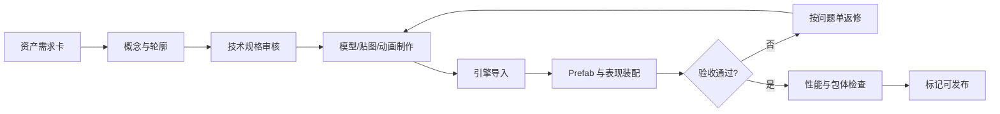

# 《潮汐猎场》资产设定清单

> 制作基线：Unity 3D 角色与场景、2.5D 横屏呈现、16:9 主视口、微信小游戏 WebGL。所有数量为首版目标，概念稿、源文件、引擎文件和验收记录必须能通过资产 ID 对应。

## 资产风格基线

- 视觉：高饱和卡通海洋、粗轮廓、软光照、夸张眼神和嘴部动作。
- 镜头：正交或弱透视侧视，鱼主要在 XY 平面移动，Z 轴用于层次和特效。
- 识别：玩家使用暖色高光，可吞噬目标为圆形轮廓，高阶威胁为尖角轮廓。
- 材质：优先共享 Shader 和材质实例；皮肤以纹理、调色和局部挂件实现。
- 性能：先满足中端手机 45—60 FPS，再增加装饰粒子和透明层。
- 原创：禁止临摹参考游戏鱼类造型、纹理、图标、UI 排版和动画节奏。

## 资产生产流程



资产需求卡至少包含：资产 ID、用途、首次出现位置、屏幕占比、交互状态、动画清单、特效/音效事件、技术预算、交付日期和负责人。

## 目录与命名

### 推荐目录

```text
Assets/TideHunt/
  Art/
    Characters/Fish/
    Environment/CoralBay/
    Props/
    VFX/
    UI/
  Audio/
    BGM/
    SFX/
    Mixers/
  Animation/
    Controllers/
    Clips/
  Materials/
  Prefabs/
    Characters/
    Environment/
    UI/
  Data/
    Species/
    Encounters/
    Cosmetics/
```

### 命名规则

| 类型 | 格式 | 示例 |
|---|---|---|
| 模型 | `CHR_Fish_<ID>_Mdl` | `CHR_Fish_SilverFry_Mdl.fbx` |
| 骨架 | `RIG_Fish_<Family>` | `RIG_Fish_Small` |
| 动画 | `AN_Fish_<Family>_<Action>` | `AN_Fish_Small_Swim.anim` |
| 纹理 | `TX_<Asset>_<Channel>_<Size>` | `TX_SilverFry_BC_512.png` |
| 材质 | `MAT_<Asset>_<Variant>` | `MAT_SilverFry_Default.mat` |
| Prefab | `PF_<Category>_<ID>` | `PF_Fish_SilverFry.prefab` |
| 特效 | `VFX_<Event>_<Variant>` | `VFX_Eat_Small_A.prefab` |
| UI 图集 | `AT_UI_<Module>` | `AT_UI_Battle.spriteatlas` |
| 音效 | `SFX_<Module>_<Event>_<NN>` | `SFX_Fish_Bite_01.wav` |
| 音乐 | `BGM_<Scene>_<State>` | `BGM_CoralBay_Normal.wav` |

ID 使用英文 PascalCase；文件名只用 ASCII、数字和下划线。版本由源代码管理，不在文件名追加 `final2`、`new` 或日期。

## 鱼类角色总表

### 玩家鱼

| ID | 中文名 | 骨架族 | 初始轮廓 | 皮肤数 | 必要动作 | 状态 |
|---|---|---|---|---:|---|---|
| OrangeDamsel | 橙尾雀鲷 | Small | 圆润短身 | 3 | 12 | 首版必做 |
| AzureDarter | 青线梭鱼 | Medium | 细长流线 | 3 | 12 | 首版必做 |
| RockscaleBream | 岩鳞鲷 | Medium | 高背厚身 | 2 | 12 | 首版必做 |
| MoonshadeFish | 月影鱼 | Small | 月牙尾鳍 | 2 | 12 | 首版必做 |
| GoldenPuffer | 金斑河豚 | Round | 球形刺轮廓 | 2 | 14 | 首版必做 |

玩家鱼共 5 个基础模型、12 套首版皮肤。进化阶段优先通过缩放、鳍/背刺挂件和材质高光变化实现，不为 6 阶各做一套完整模型。

### 生态与敌对鱼

| 类别 | 数量 | 单体预算 | 共享要求 | 备注 |
|---|---:|---|---|---|
| 鱼苗/鱼群 | 4 | 1.5k—3k 三角面 | Small 骨架 | 支持 20 条同屏 |
| 中小型猎物 | 4 | 3k—5k 三角面 | Small/Medium 骨架 | 强调不同尾鳍轮廓 |
| 中型捕食者 | 4 | 5k—8k 三角面 | Medium 骨架 | 需要咬合和冲刺 |
| 大型威胁 | 2 | 8k—12k 三角面 | Large 骨架 | 单屏通常不超过 2 条 |
| 精英鱼 | 2 | 10k—14k 三角面 | Medium/Large 骨架 | 额外挂件与技能动作 |
| 海域霸主 | 1 | 18k—24k 三角面 | Boss 独立骨架 | 三阶段、独立破绽部位 |

生态资产按策划案 12 种普通鱼、2 种精英和 1 个霸主制作。每个物种必须有正侧背三视图、纯黑剪影和与相邻阶级并排的尺寸图。

## 鱼类模型与骨架规格

| 项目 | 规格 |
|---|---|
| 单位 | 1 Unity Unit = 1 米；导入 Scale Factor 固定 1 |
| 朝向 | 模型默认朝 +X，背部朝 +Y，局内 XY 平面移动 |
| 原点 | 身体质量中心；嘴部与尾部不得作为原点 |
| 骨架根 | `Root`，子节点包含 `Body`、`Head`、`Jaw`、`Tail_01..N`、`Fin_*` |
| 吞噬点 | `Socket_Mouth`，位于闭嘴状态口腔中心 |
| 受击点 | `Socket_Hit_Center`，位于视觉质量中心 |
| 特效点 | `Socket_Head`、`Socket_Back`、`Socket_Tail`、`Socket_Belly` |
| 碰撞体 | 引擎中独立配置，不从网格自动生成 |
| 蒙皮影响 | 每顶点最多 4 根骨骼，优先 2 根以内 |
| 骨骼数量 | Small ≤ 18，Medium ≤ 24，Large ≤ 30，Boss ≤ 45 |
| BlendShape | 普通鱼 ≤ 4，玩家鱼 ≤ 8，Boss ≤ 10 |

提交模型时必须清除隐藏面、重复顶点、负缩放和未使用材质槽；法线、切线与 UV 不得在导入后自动修复掩盖源文件问题。

## 动画清单

### 通用鱼动作

| 动作 | 循环 | 长度目标 | 必做对象 | 事件点 |
|---|---|---:|---|---|
| Idle | 是 | 1.2—2.0 秒 | 全部 | 无 |
| Swim | 是 | 0.7—1.2 秒 | 全部 | 尾摆峰值 |
| Turn | 否 | 0.2—0.4 秒 | 全部 | 朝向翻转中点 |
| Flee/SpeedUp | 是/否 | 0.3—0.7 秒 | 猎物与玩家 | 冲刺起点 |
| Bite | 否 | 0.25—0.45 秒 | 捕食者与玩家 | 张嘴、咬合 |
| Hit | 否 | 0.18—0.3 秒 | 可受击对象 | 受击帧 |
| Eaten/Death | 否 | 0.5—0.9 秒 | 全部 | 隐藏网格前 |
| Spawn | 否 | 0.4—0.8 秒 | 精英与首领 | 可交互起点 |
| Blink/Gaze | 是/否 | 0.3—1.0 秒 | 玩家与主要敌人 | 无 |

玩家鱼额外需要 `LevelUp`、`Critical`、`Revive`、`Victory`；同阶战斗鱼需要 `Stagger`；精英与首领按技能追加动作。

### 首领动作

- `Boss_Enter`：入场和镜头锁定。
- `Boss_Dash_Tell/Loop/End`：冲刺预警、位移、撞击。
- `Boss_Current_Cast`：扇形水流。
- `Boss_Summon`：召群。
- `Boss_Stagger`：撞船失衡。
- `Boss_Weak_Open/Close`：破绽开启和关闭。
- `Boss_PhaseChange`：二、三阶段转换。
- `Boss_Defeat`：终局吞噬演出。

所有攻击动画必须在源文件和引擎事件表中标记前摇、命中、收招三段，命中范围由逻辑配置驱动，不直接绑定动画骨骼碰撞。

## 纹理与材质

| 资产 | 最大尺寸 | 格式 | 通道 |
|---|---:|---|---|
| 普通鱼主纹理 | 512×512 | PNG/TGA 源文件，平台压缩 | BaseColor、Mask |
| 玩家鱼/精英 | 1024×1024 | PNG/TGA 源文件 | BaseColor、Mask、Normal 可选 |
| Boss | 2048×2048，优先拆 2×1024 | PNG/TGA 源文件 | BaseColor、Mask、Normal |
| 场景模块 | 1024×1024 图集 | TGA/PNG | BaseColor、Mask |
| UI 图集 | 2048×2048 上限 | PNG | RGBA |
| 粒子纹理 | 128—512 | PNG/TGA | Alpha/Additive Mask |

Mask 推荐：R=阴影/明度遮罩，G=皮肤换色区域，B=高光，A=自发光或透明度。禁止为只改颜色的皮肤复制完整材质和 Shader。

首版材质类型控制在 8 种以内：角色普通、角色透明、角色受击、场景普通、植被摆动、水体、粒子 Alpha、粒子 Additive。

## 场景资产

### 模块数量

| 分区 | 地形/背景模块 | 大型地标 | 中型道具 | 小型装饰 | 交互危险 |
|---|---:|---:|---:|---:|---:|
| 阳光礁坪 | 8 | 2 | 10 | 18 | 2 |
| 海草回廊 | 8 | 2 | 12 | 20 | 3 |
| 沉船暗湾 | 10 | 3 | 14 | 18 | 4 |
| 通用水体/远景 | 6 | 0 | 4 | 8 | 0 |

### 必做场景清单

- 水体背景：浅水、中水、深水三组颜色与雾效参数。
- 礁石：直边、弧边、洞口、缝隙、平台、遮挡前景六类模块。
- 珊瑚：枝状、扇状、团状三族，每族 3 个变体。
- 海草：短草、中草、高草、发光草四族，支持 GPU 摆动。
- 沉船：船体、桅杆、船舱入口、断板、铁锚和宝箱区域。
- 环境危险：毒水母、鱼网残骸、暗流体积、岩缝入口。
- 交互对象：宝箱贝壳、珍珠、肉块、7 种道具。
- 远景：岩层、鱼群剪影、光柱、气泡层和漂浮颗粒。

场景模块必须支持镜像和调色复用。前景遮挡物透明度不高于 45%，且玩家进入其后方时自动淡出。

## 特效清单

| 模块 | 特效 | 数量 | 优先级 |
|---|---|---:|---|
| 移动 | 尾流、冲刺蓄力、冲刺拖尾、急转水花 | 4 | 中 |
| 吞噬 | 小/中/大吞噬、同阶终结、连食升级 | 5 | 中高 |
| 受击 | 普通受击、重击、护盾命中、护盾破裂 | 4 | 高 |
| 成长 | 经验吸收、升阶预热、升阶爆发、终阶 | 4 | 高 |
| 状态 | 7 种道具拾取与持续状态 | 14 | 中 |
| 危险 | 高阶警戒、毒、暗流、缠绕、濒死 | 5 | 最高 |
| 宝箱 | 出现光柱、开启进度、奖励爆发 | 3 | 中高 |
| 首领 | 冲刺、水流、召群、破绽、阶段变化、死亡 | 6 | 最高 |
| UI | 新纪录、成就、图鉴发现、奖励获得 | 4 | 低到中 |

单屏移动端预算：普通粒子 90、桌面 160；透明全屏层最多 2 层；同一角色拖尾最多 2 条；屏幕闪光每秒最多 2 次。

危险特效必须在减少闪光模式下仍可通过轮廓和形状识别，不能只靠颜色和亮度。

## UI 资产清单

### 页面与弹窗

| 模块 | 页面/弹窗 | 数量 |
|---|---|---:|
| 启动 | Logo、加载、更新提示、隐私授权 | 4 |
| 主界面 | 首页、模式选择、鱼种选择 | 3 |
| 局内 | HUD、暂停、进化三选一、复活、教学提示 | 5 |
| 结算 | 胜利、失败、纪录详情、战报预览 | 4 |
| 成长 | 图鉴、鱼详情、成就、外观、商品详情 | 5 |
| 社交 | 好友榜、挑战卡、云存档冲突 | 3 |
| 运营 | 活动页、赛季册、任务、奖励预览 | 4 |
| 设置 | 音频、画质、无障碍、账号与隐私 | 4 |

### 图标与通用组件

- 5 个玩家鱼头像、15 个生态鱼图标、12 个皮肤缩略图。
- 7 个道具图标、8 个构筑图标、8 个成就徽章。
- 生命、经验、体力、护盾、连食、计时、分数、贝壳币 8 类 HUD 图标。
- 16 个通用按钮/状态图标：返回、关闭、确认、取消、设置、静音、分享、帮助等。
- 9-slice 面板 6 套、按钮 5 状态、标签 4 状态、品质框 4 级。
- 好友榜头像框 3 套、战报背景 3 套、赛季主题装饰 1 套。

UI 源文件使用 Figma；组件、变量、色板和文本样式必须发布为团队库。导出 PNG 前检查 1x/2x 规格和透明边缘，不直接将整页界面烘焙成大图。

## 字体与文案资产

- 中文主字体使用具备商业授权的黑体类字体；数字分数可使用独立展示字体。
- 字体子集必须覆盖简体中文、数字、基础拉丁、常用标点和策划最终文案。
- 关键数字至少包含 0—9、加号、乘号、百分号、冒号和小数点。
- 所有按钮文案预留 30% 横向扩展；禁止把文本写进背景图片。
- 首版准备简体中文，资源结构预留繁体中文和英文，不在首版强制完成全量翻译。

## 音频资产清单

### 音乐

| 曲目 | 数量 | 时长 | 循环 |
|---|---:|---:|---|
| 主界面 | 1 | 90—120 秒 | 无缝 |
| 阳光礁坪 | 1 | 120—150 秒 | 无缝 |
| 海草回廊 | 1 | 120—150 秒 | 无缝 |
| 沉船暗湾 | 1 | 120—150 秒 | 无缝 |
| 首领战 | 1 | 100—130 秒 | 无缝，可分层 |
| 结算胜利/失败 | 2 | 8—15 秒 | 否 |

音乐交付 WAV 48 kHz/24 bit 源文件，引擎内按平台压缩。循环曲提供 Loop Start/End 样点和无响度跳变版本。

### 音效

| 类别 | 预计数量 | 变体要求 |
|---|---:|---|
| 移动与冲刺 | 10 | 小/中/大体型 |
| 吞噬与咬合 | 15 | 至少 3 个随机变体 |
| 受击与死亡 | 12 | 普通、重击、护盾、毒 |
| 成长与奖励 | 12 | 六阶音高递进 |
| 道具与状态 | 18 | 拾取与持续/结束分离 |
| 环境 | 16 | 水流、气泡、珊瑚、沉船 |
| 首领 | 14 | 前摇、攻击、破绽、阶段转换 |
| UI | 18 | 点击、返回、解锁、错误、排名 |

音效峰值不高于 -1 dBFS，提供无混响干声；响度在引擎 Mixer 中统一，不通过重复归一化破坏动态。

## 宣传与平台资产

- 小游戏图标：1024×1024 主文件，适配圆角裁切安全区。
- 启动封面：横版 1920×1080、竖版 1080×1920 各 1 套。
- 商店/分享素材：主 KV 1 套、功能截图 5 张、15 秒与 30 秒视频各 1 条。
- 战报卡：3 套主题，安全区适配不同分享裁切。
- 活动 Banner：主界面、活动页、好友分享三种比例模板。
- 审核演示图：登录、广告、支付、隐私和未成年人流程各 1 套。

宣传素材不得使用未授权海洋照片、字体、音效或参考游戏截图。

## 性能与包体预算

| 指标 | 首版预算 | 红线 |
|---|---:|---:|
| 首包下载 | ≤ 8 MB | 10 MB |
| 首次可操作所需资源 | ≤ 18 MB | 25 MB |
| 单海域增量包 | ≤ 22 MB | 30 MB |
| 峰值纹理内存 | ≤ 55 MB | 70 MB |
| 角色网格与动画内存 | ≤ 30 MB | 40 MB |
| 音频常驻 | ≤ 12 MB | 16 MB |
| 同屏 Skinned Mesh | 移动 24 / 桌面 40 | 移动 30 / 桌面 50 |
| 同屏材质实例 | 移动 35 / 桌面 55 | 移动 45 / 桌面 70 |
| Draw Calls | 移动 ≤ 120 | 160 |

超过预算 80% 即触发技术美术复审，不能等到 Beta 再统一优化。

## 资产清单字段

正式资产表至少包含以下列：

```text
AssetID, 中文名, 类型, 模块, 阶级/区域, 优先级,
概念负责人, 制作负责人, 技术审核人, 计划日期, 当前状态,
源文件路径, 引擎路径, Prefab路径, 三角面, 骨骼数,
纹理尺寸, 材质数, 动画数, 内存估算, 首次引用场景,
版权来源, 验收版本, 返修次数, 备注
```

状态只能使用：`Requested`、`ConceptApproved`、`InProduction`、`TechReview`、`InEngine`、`Accepted`、`Deprecated`。不使用“差不多”“待看看”等非结构化状态。

## 单资产验收

### 角色验收

- [ ] 剪影与同阶相邻鱼种可区分，尺寸关系与设计表一致。
- [ ] 原点、朝向、命名、骨架、Socket 和比例符合规范。
- [ ] 动画无脚滑式漂移、尾部穿身和首尾跳帧。
- [ ] 口部吞噬点与实际张嘴动作对齐。
- [ ] 受击、危险和可吞噬轮廓在三档画质下可读。
- [ ] 材质、纹理、网格、骨骼和 BlendShape 未超预算。
- [ ] 对象池重复启用后动画、材质参数和特效状态正确重置。

### 场景验收

- [ ] 模块拼接无明显缝隙，镜像和调色不会露出错误法线。
- [ ] 前景遮挡可自动淡出，不盖住玩家与危险提示。
- [ ] 碰撞体与视觉边界一致，大型鱼和小型鱼通路符合设计。
- [ ] 远景、装饰和交互层级正确，不参与不必要的碰撞与 AI 查询。
- [ ] 同一遭遇块在三档画质和两种屏幕比例下均可读。

### UI 验收

- [ ] 触控热区不小于 44×44 CSS 像素，按钮五态完整。
- [ ] 200% 字体缩放下主要操作仍可见，长文本可滚动。
- [ ] 色盲模式下规则不只依靠红绿区别。
- [ ] 图集无透明毛边、重复大图和未引用 Sprite。
- [ ] 文本未烘焙进背景，数字字体包含全部符号。

### 音频验收

- [ ] 循环无爆音、断点和响度跳变。
- [ ] 相同高频事件具备随机变体与频率限制。
- [ ] 威胁、受击、奖励和 UI 音效在混音中层级清晰。
- [ ] 静音、后台切换、耳机插拔后播放状态正确。

## 外包交付包

外包需求必须同时提供：风格板、尺寸对比、技术规格、动作表、命名模板、参考 Prefab、验收清单和返修轮次。外包方交付源文件、导出文件和使用到的第三方授权清单。

禁止只收 FBX/PNG 而不收源文件；禁止把未知来源材质、插件、字体或音频直接并入项目。所有外包资产先进入隔离目录，通过版权和技术检查后再迁入正式目录。

## 首版资产量汇总

| 大类 | 预计核心资产 | 主要变体 |
|---|---:|---:|
| 玩家鱼模型 | 5 | 12 套皮肤、6 阶挂件/材质变化 |
| 生态/敌对鱼 | 15 | 3 个共享骨架族 + 1 个 Boss 骨架 |
| 鱼类动画 | 约 145 条 Clip | 通用动作复用 + 技能动作 |
| 场景模块 | 32 | 调色、镜像和材质变体 |
| 场景道具/装饰 | 104 | 密度和画质档位变体 |
| 环境危险/交互物 | 16 | 状态与破坏变体 |
| VFX Prefab | 45 | 低/中/高画质分级 |
| UI 页面/弹窗 | 28 | 横屏与安全区适配 |
| UI 图标/徽章 | 约 95 | 状态、品质和赛季变体 |
| 音乐 | 7 首 | 分层与循环版本 |
| 音效 | 约 115 条 | 随机变体与体型分层 |
| 宣传/平台资产 | 18 组 | 比例和渠道适配 |

该汇总用于估算产能，不替代正式资产表。任何新增资产必须说明玩家价值、首次出现位置和被删除时的体验影响。

