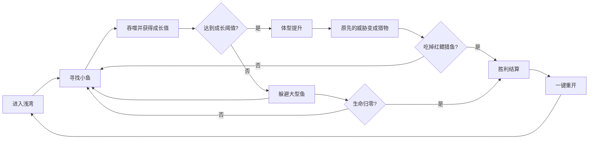

# 《潮汐猎场》最小 MVP 方案

> 目标不是做一个内容不完整的正式版本，而是用 4 周验证最核心的问题：玩家是否能快速理解大小关系，并在两分钟内从“躲避某条鱼”成长为“能够反过来吃掉它”。

## MVP 结论

最小可行范围为：

- 1 张固定珊瑚浅湾地图。
- 1 条玩家鱼，只有缩放和高光变化，不换模型。
- 5 种生态鱼，覆盖猎物、阶段目标和终局威胁。
- 3 段体型成长。
- 移动、冲刺、吞噬、受伤、死亡、胜利、重开。
- 1 个 HUD、1 个结算页、1 个本地最高分。
- 单局 90—180 秒，不登录、不联网、不接广告。

除此以外全部延后。MVP 通过后，才允许进入完整策划案的垂直切片阶段。

## 要验证的三个假设

| 假设 | 验证问题 | 通过标准 |
|---|---|---|
| H1 规则直觉 | 玩家不看长教程能否判断谁能吃、谁危险 | 10 名新玩家中至少 8 人在 15 秒内正确说明规则 |
| H2 成长快感 | 体型变化是否足以带来明确的变强感 | 至少 7 人主动提到“变大后能吃之前的敌人” |
| H3 复玩动力 | 失败或胜利后是否愿意立即再来一局 | 至少 50% 测试者在无引导情况下重开 |

好友榜、图鉴、皮肤、商业化和首领无法证明这三个假设，因此不进入 MVP。

## 最小核心循环



## 范围定义

### 必须实现

| 模块 | 最小内容 | 为什么必须存在 |
|---|---|---|
| 输入 | 触控拖动、鼠标跟随、WASD 三选一适配；冲刺键 | 验证移动是否顺手 |
| 角色移动 | 八方向移动、转向、轻惯性、地图边界 | 支撑全部玩法 |
| 吞噬判断 | 小一档及以下可吃；同档推开；大一档及以上造成伤害 | 建立大小规则 |
| 成长 | 3 个阶段、2 次升级、镜头与碰撞体同步变化 | 验证身份反转 |
| AI | 鱼群巡游/逃跑，大鱼巡游/追击 | 形成猎物和威胁 |
| 冲刺 | 固定距离、3 秒冷却，不设体力条 | 提供追逐和逃生操作 |
| 生存 | 3 点生命、受击击退、0.8 秒无敌 | 提供容错和失败 |
| 目标 | 第 3 阶段吃掉 1 条红鳍猎鱼即胜利 | 明确终点 |
| UI | 生命、成长条、分数、冲刺冷却、结果页 | 让状态可读 |
| 记录 | 本地最高分和最快完成时间 | 提供最小复玩动机 |
| 音画反馈 | 吞噬、受击、升级、危险轮廓、胜负 | 验证“爽感”而非纯规则 |

### 明确不做

- 不做同阶失衡战斗和自动攻击。
- 不做 Buff、道具、肉块、宝箱和复活。
- 不做首领、精英、环境危险和随机事件。
- 不做多海域、程序化关卡和每日种子。
- 不做鱼种选择、皮肤、图鉴、成就、任务和经济系统。
- 不做登录、云存档、好友榜、分享、广告、支付和运营活动。
- 不做复杂设置，仅保留静音与暂停。
- 不做正式剧情、旁白、角色养成和新手任务链。

任何新增需求必须先从上述延后列表中说明它直接验证哪一条 MVP 假设，否则拒绝进入本轮。

## 具体游戏规则

### 单局结构

- 地图：固定 2200×1240 世界单位的封闭浅湾。
- 时长：目标 90—180 秒；超过 180 秒未完成则以当前分数结算失败。
- 出生：玩家位于中央安全区，前 6 秒大型鱼不主动追击。
- 胜利：成长到第 3 阶段后，吃掉 1 条红鳍猎鱼。
- 失败：生命归零或 180 秒超时。
- 重开：结算页主按钮直接重置全部局内状态，加载不超过 1 秒。

### 大小规则

所有生物使用离散等级，不用屏幕像素直接判断：

```text
目标等级 <= 玩家等级 - 1：可直接吞噬
目标等级 == 玩家等级：不可吞噬，不受伤，轻微推开
目标等级 >= 玩家等级 + 1：玩家受伤并被击退
```

| 玩家阶段 | 玩家等级 | 能吃 | 同档 | 必须躲避 |
|---|---:|---|---|---|
| 小鱼 | 1 | 银点鱼苗、泡泡鳀 | 珊瑚豆鱼 | 红鳍猎鱼、铁背鲸鱼 |
| 成鱼 | 2 | 鱼苗、泡泡鳀、珊瑚豆鱼 | 红鳍猎鱼 | 铁背鲸鱼 |
| 大鱼 | 3 | 鱼苗、泡泡鳀、珊瑚豆鱼、红鳍猎鱼 | 无 | 铁背鲸鱼 |

红鳍猎鱼在第一阶段是强威胁，第二阶段变成同档目标，第三阶段变成胜利猎物，承担整个 MVP 的身份反转。

### 成长与分数

| 对象 | 等级 | 成长值 | 分数 | 数量上限 |
|---|---:|---:|---:|---:|
| 银点鱼苗 | 0 | 1 | 10 | 12 |
| 泡泡鳀 | 0 | 1 | 12 | 8 |
| 珊瑚豆鱼 | 1 | 3 | 30 | 6 |
| 红鳍猎鱼 | 2 | 8 | 100 | 3 |
| 铁背鲸鱼 | 4 | 0 | 0 | 1 |

- 第 2 阶段阈值：累计 8 点成长值。
- 第 3 阶段阈值：累计 24 点成长值。
- 成长值溢出保留；升级时恢复 1 点生命。
- 连续 2 秒内吞噬下一目标，分数倍率增加 0.25，最高 2 倍。
- 受伤或超时会清空连食倍率。

### 生命与冲刺

- 玩家生命：3 格，不使用百分比血条。
- 高一档碰撞：1 点伤害；高两档及以上：2 点伤害。
- 受击后：击退 0.25 秒、无敌 0.8 秒，危险鱼不能连续扣血。
- 冲刺：沿当前移动方向位移 220 单位，持续 0.18 秒，冷却 3 秒。
- 冲刺没有无敌，不穿越鱼或地图边界。

## 最小 AI

只实现两套状态机：

### 猎物 AI

```text
巡游 → 玩家进入警戒半径且等级更高 → 远离玩家
逃跑超过 2 秒且距离安全 → 返回巡游
```

银点鱼苗和泡泡鳀使用鱼群中心移动；珊瑚豆鱼单体移动。鱼群不做复杂编队，只保持最小距离和同向偏好。

### 威胁 AI

```text
巡游 → 玩家进入追击半径且等级更低 → 追击
追击超过 3 秒或距离过远 → 返回巡游
```

红鳍猎鱼会追击低等级玩家；与玩家同档后停止主动追击。铁背鲸鱼始终是威胁，但移动慢、转向慢，并有明显红色尖角轮廓。

AI 每 6 个逻辑 tick 决策一次，移动每 tick 更新。MVP 不做寻路，只使用软边界和简单避让。

## 最小地图

浅湾只需要四个功能区域：

| 区域 | 作用 | 内容 |
|---|---|---|
| 中央出生区 | 教学与安全开局 | 鱼苗、珊瑚、无大型鱼 |
| 左侧鱼群区 | 稳定成长 | 高密度银点鱼苗和泡泡鳀 |
| 右侧猎手区 | 中期风险 | 珊瑚豆鱼和红鳍猎鱼 |
| 上方鲸鱼航道 | 持续压迫 | 铁背鲸鱼固定巡游路线 |

地图使用固定布置和固定刷新点。若固定地图的核心循环尚不好玩，不允许用程序化地图掩盖问题。

## 最小 UI

### 页面

1. 开始遮罩：标题、“开始游戏”、一句规则“吃小鱼，躲大鱼”。
2. 局内 HUD：3 格生命、成长条、分数、冲刺冷却、暂停。
3. 结算页：胜利/失败、本局分数、最快完成/最高分、“再来一局”。

### 提示

- 可吞噬目标：绿色圆形轮廓，进入近距离才显示。
- 同档目标：黄色虚线轮廓。
- 危险目标：红色尖角轮廓，屏外时显示方向箭头。
- 第一次升级：0.6 秒慢动作、角色放大、镜头拉远、提示“现在可以吃珊瑚豆鱼”。
- 第二次升级：提示“现在可以反吃红鳍猎鱼”。

不制作图鉴、任务、商店或任何无实际功能的灰色入口。

## 最小资产清单

MVP 可使用简化的最终风格资产，不要求达到商业发行品质，但必须保留正确轮廓和反馈。

| 类别 | 数量 | 最低要求 |
|---|---:|---|
| 玩家鱼模型 | 1 | 1 个材质，3 阶仅缩放与高光变化 |
| 生态鱼模型 | 5 | 鱼苗两种可共用模型换色；其余轮廓独立 |
| 共享骨架 | 3 | Small、Medium、Large |
| 通用动画 | 6 类 | Idle、Swim、Turn、Flee、Bite、Eaten/Hit |
| 场景模块 | 8 | 水体、礁石、珊瑚、海草、远景，可重复拼接 |
| 特效 | 7 | 吞噬、受击、升级、冲刺、危险、胜利、死亡 |
| UI 页面 | 3 | 开始、HUD、结算 |
| UI 图标 | 8 | 生命、成长、分数、冲刺、暂停、静音等 |
| 音乐 | 1 | 90 秒以上无缝循环 |
| 音效 | 12—15 | 吞噬 3、受击 2、升级 2、冲刺 2、UI 3、胜负 2 |

若美术资源来不及，允许鱼苗、泡泡鳀共用模型换色；不允许玩家鱼、红鳍猎鱼和铁背鲸鱼共用轮廓，因为三者承担核心规则识别。

## 技术最小结构

```text
GameLoop
├─ Input：移动方向、冲刺、暂停
├─ World：玩家、鱼群、刷新、边界
├─ Rules：等级关系、伤害、成长、计分
├─ AI：猎物状态机、威胁状态机
├─ Events：吞噬、受击、升级、胜负
├─ View：角色、镜头、特效、音频
└─ Save：最高分、最快完成、静音
```

- 固定 60Hz 逻辑；渲染帧率不改变吞噬和伤害结果。
- 所有鱼使用对象池，不在局内频繁实例化和销毁。
- 使用简单空间网格查询附近目标，不做全体两两碰撞。
- 存档只保存三个字段：最高分、最快完成时间、静音状态。
- 不建立后端，不接平台登录；先输出 PC/Web 或微信开发者工具可玩包。

## 4 周执行计划

### 团队假设

- Unity 客户端程序 1 人。
- 3D/技术美术 1 人。
- 策划/制作人 1 人。
- QA/音频支持 0.5—1 人。

### 周计划

| 周次 | 重点 | 程序交付 | 美术/音频交付 | 策划/QA 交付 | 周末门槛 |
|---|---|---|---|---|---|
| 第 1 周 | 灰盒核心 | 移动、边界、吞噬、基础 AI | 玩家/猎物/威胁灰模 | 规则表、测试场景 | 能玩 60 秒并发生吞噬和死亡 |
| 第 2 周 | 成长闭环 | 三阶段、冲刺、生命、胜负、重开 | 5 种鱼可识别模型、基础动作 | 数值表、10 个固定测试 | 能完整胜利或失败并一键重开 |
| 第 3 周 | 反馈与 UI | HUD、轮廓、镜头、存档、音频事件 | 场景、VFX、UI、音效 | 5 人内部试玩与调参 | 玩家能说清大小规则和成长变化 |
| 第 4 周 | 真机与验证 | 性能、输入适配、构建、缺陷修复 | 资源压缩、表现修正 | 10 人盲测、结果报告 | 达到三条核心假设的通过标准 |

第 4 周不新增功能，只修复规则理解、手感、严重表现和性能问题。

## 任务清单

| ID | 任务 | 预计人日 | 前置 | 验收 |
|---|---|---:|---|---|
| MVP-P01 | 冻结大小关系、成长阈值、胜负条件 | 1 | 无 | 规则表可执行 |
| MVP-T01 | 输入与八方向移动 | 2 | MVP-P01 | 触控/键鼠响应正确 |
| MVP-T02 | 鱼实体、对象池和空间查询 | 3 | MVP-T01 | 30 条鱼稳定运行 |
| MVP-T03 | 吞噬、伤害、击退、无敌 | 3 | MVP-T02 | 关系矩阵测试通过 |
| MVP-T04 | 两类 AI 与刷新 | 3 | MVP-T02 | 巡游、逃跑、追击可读 |
| MVP-T05 | 三阶段成长与镜头 | 2 | MVP-T03 | 升级无穿模和误伤 |
| MVP-T06 | 冲刺、胜负、结算、重开 | 2 | MVP-T03 | 全流程无死路 |
| MVP-T07 | HUD、轮廓和本地记录 | 2 | MVP-T05 | 状态和纪录正确 |
| MVP-A01 | 角色灰模与轮廓评审 | 2 | MVP-P01 | 黑色剪影可区分 |
| MVP-A02 | 6 个角色最终简模与动画 | 7 | MVP-A01 | 进入引擎并通过预算 |
| MVP-A03 | 浅湾场景、UI 和 7 个 VFX | 6 | MVP-A01 | 不遮挡危险信息 |
| MVP-S01 | 音乐与 12—15 个音效 | 2 | 事件表 | 吞噬、危险、升级可区分 |
| MVP-Q01 | 自动化规则测试 | 2 | MVP-T03 | 等级矩阵和同 tick 结算通过 |
| MVP-Q02 | 10 人盲测与结论报告 | 3 | 可玩包 | 输出指标和是否继续建议 |

## 测试与验收

### 自动化最低测试

- 三个玩家阶段对五种生态鱼的吞噬/伤害关系全部正确。
- 同一 tick 只吞噬一个目标，稳定选择最近目标。
- 受击无敌期间不重复扣血。
- 成长值溢出保留，升级恢复生命但不超过 3 格。
- 重开后鱼群、生命、成长、分数、计时和冷却全部重置。
- 对象池复用后等级、材质、AI 和碰撞状态没有残留。
- 连续运行 10 分钟无实体数量增长和明显内存泄漏。

### 盲测流程

1. 不解释规则，让测试者看到开始页后独立操作。
2. 记录第一次移动、第一次吞噬、第一次受伤、第一次升级的时间。
3. 第一次死亡后不提示是否重开，观察自然选择。
4. 完成两局后询问：谁能吃、谁危险、升级改变了什么、哪里不公平。
5. 记录测试者是否主动追逐红鳍猎鱼，以及第 3 阶段是否产生“反吃”感受。

### 通过指标

| 指标 | 目标 |
|---|---:|
| 首次成功吞噬时间中位数 | ≤ 10 秒 |
| 正确理解大小规则 | ≥ 80% 测试者 |
| 首次升级时间中位数 | 35—60 秒 |
| 两分钟内到达第 3 阶段 | 30%—50% 测试者 |
| 明确感受到身份反转 | ≥ 70% 测试者 |
| 无引导主动重开 | ≥ 50% 测试者 |
| 无法解释的死亡反馈 | ≤ 10% 死亡次数 |
| 中端手机平均帧率 | ≥ 45 FPS |
| 首次可操作时间 | ≤ 5 秒 |
| 峰值内存 | ≤ 120 MB |

## 结果决策

### MVP 通过

三条核心假设全部通过，且不存在 P0/P1 缺陷。下一阶段优先增加：正式 6 阶成长、同阶失衡战斗、第二视觉分区、道具与宝箱。仍不立即加入商业化和长期养成。

### 有条件通过

H1 规则理解通过，但 H2 或 H3 未通过。再进行最多两周的手感与反馈迭代，只允许调整移动、刷新、成长阈值、危险提示和结算，不增加内容系统。

### MVP 失败

以下任一情况出现，应暂停扩量并重新评估：

- 少于 60% 玩家能正确判断大小关系。
- 玩家升级后仍未意识到猎物关系变化。
- 两轮调参后主动重开率仍低于 30%。
- 核心碰撞误判无法通过轮廓与碰撞区调整解决。
- 目标设备为保持 45 FPS 必须把同屏鱼数降到 12 以下。

失败时不以增加图鉴、奖励、广告或更多鱼种掩盖核心问题。

## MVP 后的功能顺序

| 优先级 | 功能 | 进入条件 |
|---|---|---|
| P1 | 6 阶成长、同阶失衡、第二分区 | MVP 三假设通过 |
| P1 | 4 种道具、宝箱、复苏珍珠 | 核心局时长稳定在 3—4 分钟 |
| P2 | 15 种生态鱼、第三分区、首领 | 内容生产管线和性能通过 |
| P2 | 图鉴、成就、外观、本地经济 | 至少 30 人测试确认复玩需求 |
| P3 | 登录、云存档、好友榜、分享 | 单机闭环和规则版本冻结 |
| P3 | 广告、商品、赛季、活动 | 留存与商业化测试方案获批 |

这张顺序表是范围闸门。后续功能不能因为“容易接”或“市场上都有”而提前进入开发。

