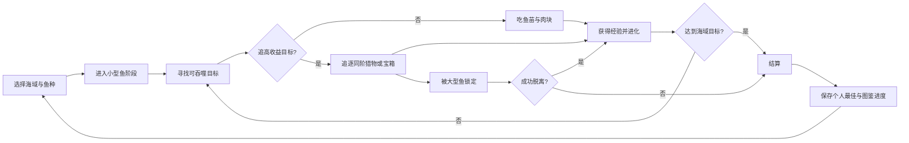
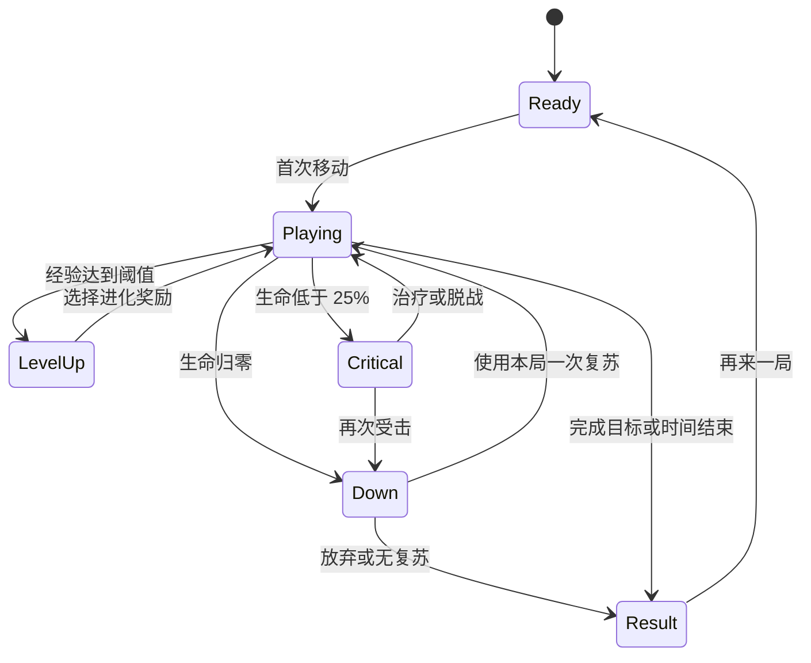

# 《潮汐猎场》游戏策划文档集

> 状态：独立新项目提案，仅借鉴“大鱼吃小鱼”的品类乐趣，不属于当前仓库既有游戏的功能规划。

这套文档基于《鱼吃鱼》PC 微信小游戏实机观察、本地运行日志与资源命名核对整理而成。目标不是复刻原作，而是提炼“移动—吞噬—变大—挑战更强目标”的品类乐趣，设计一款拥有原创鱼种、海域、数值和商业节奏的微信小游戏《潮汐猎场》（工作名）。

## 阅读顺序

| 文档 | 解决的问题 | 主要读者 |
|---|---|---|
| [试玩感想与拆解](./00-playtest-impressions.md) | 《鱼吃鱼》好玩在哪里、问题在哪里 | 全员 |
| [产品与核心循环](./01-product-and-core-loop.md) | 做什么、为谁做、每局如何运转 | 全员 |
| [局内玩法系统](./02-gameplay-systems.md) | 吞噬、成长、战斗、AI、道具如何工作 | 策划、程序 |
| [内容与关卡设计](./03-content-and-level-design.md) | 海域、鱼群、遭遇和难度如何编排 | 关卡、数值、美术 |
| [成长与经济](./04-progression-and-economy.md) | 局外解锁、货币和长期目标如何闭环 | 系统、数值、客户端 |
| [UI、艺术与音频](./05-ui-art-audio.md) | 页面、HUD、反馈和无障碍标准 | UI、视觉、音频、前端 |
| [数值、数据与验收](./06-balance-data-qa.md) | 首版参数、配置结构、测试和验收口径 | 程序、数值、QA |
| [观察证据与设计推导](./07-evidence-and-design-rationale.md) | 哪些来自观察，哪些是原创方案 | 负责人、主策、制作人 |
| [商业化与运营](./08-monetization-and-liveops.md) | 广告、活动、社交和版本节奏如何设计 | 制作人、运营、商业化 |
| [开发执行流程](./09-development-execution-plan.md) | 如何按团队、任务、依赖和里程碑落地 | 制作人、项目经理、全员 |
| [资产设定清单](./10-asset-specification-checklist.md) | 需要制作哪些资产、规格和验收口径 | 美术、技术美术、音频、外包 |
| [最小 MVP 方案](./11-minimum-mvp.md) | 用最低成本验证吞噬成长是否成立 | 制作人、原型团队、投资/立项评审 |

## 一句话定位

一款 3—6 分钟一局、单指即可游玩的微信海洋吞噬游戏：玩家从小鱼开始，在危险鱼群中选择猎物、连续进化，最终完成海域目标或在失误后立即重开。

## 产品支柱

- 一眼可判断：比我小的能吃，比我大的必须躲，危险信息不依赖阅读长文本。
- 每十秒有成长：经验、体型、技能、目标或环境至少有一项发生变化。
- 风险由玩家选择：安全吃小鱼稳定成长，追逐同阶目标则收益更高但会暴露位置。
- 短局也有长期目标：每日海域、个人最佳、好友榜、鱼类图鉴与赛季收藏共同提供复玩动力。
- 反馈夸张但规则克制：吞噬、升级、濒死和逆转都要“看得见、听得懂”，数值关系保持简单。

## 核心循环

## 局内状态

## 版本范围

首个可玩版本包含：

- 1 个海域、3 个视觉分区、12 种普通鱼、2 种精英鱼、1 个海域霸主。
- 6 段体型成长、4 类基础 AI、6 种局内增益、1 种宝箱事件。
- 键鼠与触控双输入、个人最佳、鱼类图鉴、8 个本地成就。
- 首版接入好友榜、云存档和克制的激励广告；不做实时多人、不卖战斗数值。

## 关键成功指标

指标通过匿名行为数据、人工试玩记录和自动化模拟共同评估：

| 指标 | 首版目标 |
|---|---:|
| 新玩家首次存活时长中位数 | 90—180 秒 |
| 单局目标时长 | 3—6 分钟 |
| 前 60 秒进化次数 | 2—3 次 |
| 无法理解死亡原因的试玩反馈 | 少于 10% |
| 结束后 10 秒内主动重开比例（人工测试） | 高于 60% |
| 标准路线完成率 | 20%—35% |

## 设计红线

- 不照搬参考游戏的鱼类模型、UI 图标、文案、数值表或关卡布局。
- 排名与百分比必须来自真实平台数据，接口不可用时降级为个人最佳。
- 广告复活是可选补充，每局最多一次；局内复苏珍珠仍可通过游玩获得。
- 不让永久成长直接改变吞噬等级关系，避免“老玩家碾压规则”。
- 不用随机秒杀；所有致命威胁至少提供轮廓、方向、音效中的两种预警。
