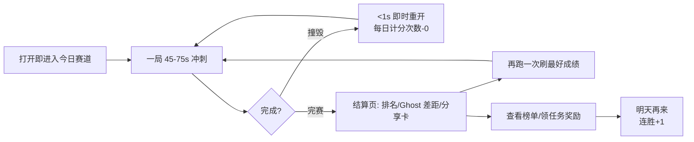

# 游戏架构 — Dashline《每日冲刺》

> 类型：超休闲 · 单指竞速 · 异步 PvP
> 平台：Web（手机竖屏优先，桌面兼容）
> 单局时长：45–75 秒 | 目标次留 ≥ 35%，7 留 ≥ 12%

---

## 1. 核心循环

设计要点：

- **打开即玩**：无主城、无加载页，Boot 后直接站在今日赛道起点。
- **失败廉价**：死亡瞬间自动重开，重开延迟必须 < 1 秒（含资源）。
- **每日稀缺感**：每天计分次数有限（见 §4），练习无限但只有前 N 次"计入成绩"，制造"今天我要打出最好一次"的目标感。

---

## 2. 操作设计（超休闲手感的命脉）

单指竖屏，两个手势封顶：

| 手势 | 行为 | 手感参数 |
|---|---|---|
| 点按 | 跳跃 | 起跳响应 ≤ 2 帧 |
| 长按 | 更高跳跃（蓄力上限 250ms） | 松手即起跳 |
| 下滑（可选，v1.1 再上） | 快速下坠/滑铲 | 用于吃低空金币路线 |

必做的"宽容性"细节（决定留存的手感三件套）：

1. **Input Buffer（输入预输入）**：落地前 100ms 内的点按会在落地瞬间生效；
2. **Coyote Time（土狼时间）**：离开平台边缘后 80ms 内仍可起跳；
3. **即时重开**：死亡动画 ≤ 300ms，随后直接回到起点。

反馈层（Juice）：屏幕震动、挤压拉伸（squash & stretch）、hit-stop（撞击定帧 80ms）、金币音高递增连击音。

---

## 3. 关卡结构：种子化程序生成

每天一条全球统一的赛道，由 `每日种子` 驱动确定性生成：

- **长度**：约 500m，完赛用时 45–75s；
- **分段拼装**：从手工调校的"路段积木库"中按种子抽取拼接（保证每段单独好玩，整体不失控）：
  - 热身段（教学式，前 10%）
  - 节奏段（连续障碍，考验肌肉记忆）
  - 选择段（上路险/下路稳的分岔，吃币 vs 保平安）
  - 高潮段（最后 15%，密度峰值）
  - 终点冲刺线
- **难度曲线**：全局密度随当日进度上升；每周引入 1 个新机制积木（移动平台、弹射器…）保持新鲜度；
- **积木库（core.2 已实现）**：平地 / 三档宽坑（按跳跃能力比例取宽）/ 尖刺簇（1–3 连）/ 浮空台阶 / 奖励拱弧，以及三种机制积木：
  - 🍄 **弹跳菇大峡谷**（35% 后解锁）：超宽坑物理上不可直越，必须跳上中央菇岛借弹射过第二段；
  - 🚧 **低空刺梁**（22% 后解锁）：悬梁 + 地面刺组合——点按短跳从梁下穿过（顶点擦线而过），中长按开始撞梁，满蓄力必死。克制无脑长按的核心 counter；
  - 💥 **碎裂桥**（35% 后解锁）：三块碎裂板铺在坑上，踩上即倒计时（~0.43s），正常节奏擦着碎裂通过，停留即塌。
- **主题轮换**：每日主题色/场景皮肤由种子派生，截图观感每天不同，强化"今天是新的一天"。

---

## 4. 模式矩阵

### 4.1 每日跑（核心模式）
- 全世界同一张图，当日重置；
- **计分规则**：每日前 5 次完赛计入成绩（取最优）；之后进入练习模式不再计分；
- 排名依据：完赛者按用时升序，未完赛者按距离降序排在完赛者之后。

### 4.2 Ghost 对战（异步 PvP 的灵魂）
- 结算页/起点处可选 1–3 个 Ghost 同跑：
  - **好友 Ghost**：分享链接带来的对手；
  - **Top Ghost**：当前榜单第 1 / 第 10 名；
  - **昨日之我**：自己昨天最好的那一次。
- Ghost 就是对方当日的输入流回放（见 tech-architecture §6），半透明剪影渲染，碰撞互不影响。

### 4.3 房间赛（私有异步锦标赛）
- 创建房间 → 生成邀请链接（含房间码）→ 24 小时窗口内所有人跑同一张图 → 房内独立榜单；
- 无需同时在线，群聊裂变的主载体；
- 房间支持自定义种子池（周末聚会场景）。

### 4.4 无限练习
- 随机种子、不计分、死亡即重开，给硬核玩家刷肌肉记忆的沙盒。

---

## 5. 元游戏（Meta Loop）

| 系统 | 内容 | 目的 |
|---|---|---|
| 连胜 Streak | 连续每日参与 +1，断签清零；里程碑给皮肤碎片 | 次留/周留的核心抓手 |
| 每日任务 | "今日进前 25%"、"收集 80 金币"、"赢一次 Ghost" | 引导体验所有系统 |
| 周赛季 | 周一重置的 7 天累计积分榜，段位徽章（木→金→钻石） | 中期目标 |
| 收集 | 角色、拖尾特效、死亡特效，用连胜/任务货币解锁 | 长线追求 + 自我表达 |

原则：**所有元游戏都不影响当局公平**——纯外观向，没有付费数值。

---

## 6. 数值框架

- **金币**：赛道内拾取；单局收入 = 拾取 × (1 + 连击系数)，激励冒险路线；
- **计分公式（榜单排序键）**：
  - 完赛：`score = 10_000_000 - time_ms`（用时越短越高）；
  - 未完赛：`score = distance_m * 100 + coins`（恒小于任何完赛分）；
- **匹配感知**：榜单永远显示"百分位"（如"前 0.8%"），小基数时段避免新人被绝对名次劝退；
- **防挫败**：连续 5 次未完赛后，热身段障碍密度临时下调（客户端本地即可，不进确定性问题——只影响练习体感，计分局关闭）。

---

## 7. 传播设计（增长引擎）

1. **结果分享卡**：类 Wordle 的 emoji 成绩条 `🏁🟩🟩⬜💥 ⏱52.31s` + 名次 `今日 #128 / 45,210 · 前 0.3%`，一张图讲清楚一切；
2. **复仇链接**：分享卡内置"点击超越我"深链，落地直接摆好对方的 Ghost；
3. **房间邀请**：链接即入房，24h 有效；
4. 断点续玩：PWA 安装提示 + 每日推送（可选）。

---

## 8. 商业化（轻量、不伤手感）

| 点位 | 形式 | 原则 |
|---|---|---|
| 复活 | 撞毁后看广告原地复活 1 次/日 | 仅每日 1 次，绝不强制 |
| 双倍金币 | 结算页可选 | 可跳过 |
| 内购 | 去广告买断 + 外观礼包 | 无数值付费 |

---

## 9. 风险与对策

| 风险 | 对策 |
|---|---|
| 种子图当天被"背版"刷榜 | 密度峰值段 + 输入流服务端重放，脚本收益趋近于零 |
| 单玩法疲劳 | 每周新积木 + 周末特殊规则房（如"反向跑"） |
| 小时区问题 | 以 UTC 日切，客户端显示本地倒计时 |
| 冷启动无 Ghost | 用官方 Bot Ghost（预设输入流）垫底各百分位 |

---

下一步阅读：[tech-architecture.md](./tech-architecture.md)（这套设计如何用"确定性模拟"低成本落地）。
