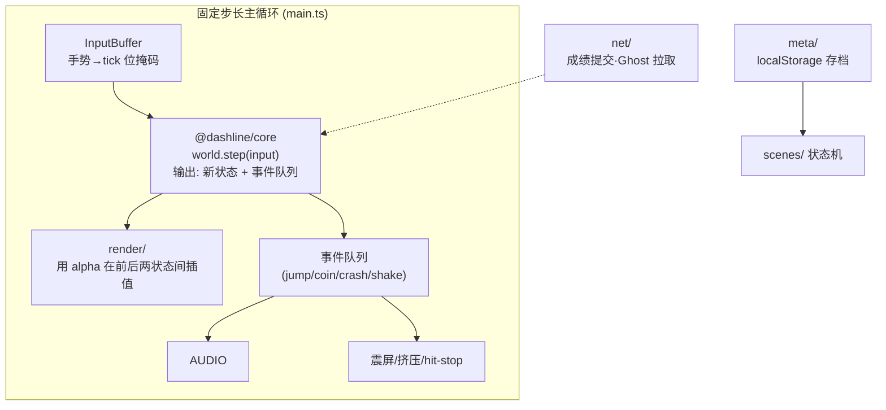
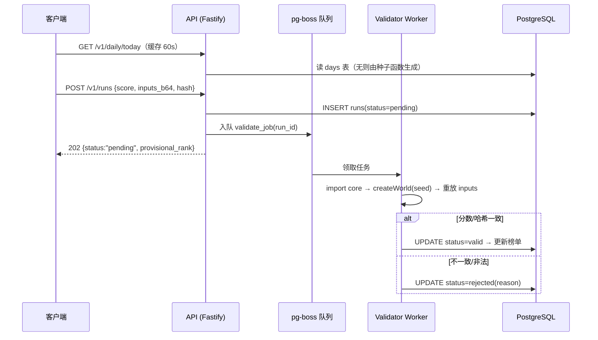

# 技术架构 — Dashline《每日冲刺》

> 目标：Web 端 60fps 超休闲手感 + 异步多人 + 每日挑战，**v1 零长连接、零实时服务器**。
> 一切围绕一个地基：**确定性模拟核（Deterministic Sim Core）**。

---

## 1. 技术选型

| 层 | 选型 | 理由 |
|---|---|---|
| 构建 | Vite 5 + TypeScript | 秒级 HMR，产物小 |
| 渲染 | **PixiJS v8**（WebGL/WebGPU） | 轻、可控、无内置物理绑架；备选 Phaser 3（全家桶但更重，且默认物理非确定性，需自建循环绕开） |
| 逻辑核 | **纯 TS 包，零依赖** | 同一份代码跑浏览器 + Node（验证器），这是确定性的前提 |
| UI | DOM/CSS 覆盖层 | 榜单/结算页用 HTML 比 canvas 文本便宜得多 |
| 后端 | Node 20 + **Fastify** | 高性能 REST，schema 校验内建 |
| 数据库 | **PostgreSQL 16** | 关系型够用；pg-boss 用它顺带当任务队列，v1 不引入 Redis |
| 队列 | **pg-boss** | Postgres-backed，重放验证任务削峰 |
| 包管理 | pnpm workspaces（monorepo） | core/shared 多端共享 |

---

## 2. Monorepo 结构

```
webGame/
├─ apps/
│  ├─ client/            # Vite + PixiJS 游戏客户端
│  │  └─ src/
│  │     ├─ scenes/      # Boot / Home / Game / Result / Board
│  │     ├─ render/      # PixiJS 视图，插值渲染 core 状态
│  │     ├─ audio/       # WebAudio，消费 core 事件队列
│  │     ├─ net/         # fetch 封装、离线补提交队列
│  │     ├─ meta/        # 存档、连胜、任务、皮肤
│  │     └─ main.ts      # 固定步长主循环
│  ├─ api/               # Fastify REST 服务
│  └─ validator/         # 重放验证 worker（import @dashline/core）
├─ packages/
│  ├─ core/              # ★ 确定性模拟核：step(state, input)、种子生成器、碰撞、计分
│  ├─ shared/            # 协议类型(zod)、输入编解码、PRNG、常量、版本号
│  └─ config/            # env schema（t3-env 风格校验）
├─ docs/
├─ docker-compose.yml    # 本地: postgres + api + validator
└─ pnpm-workspace.yaml
```

---

## 3. 客户端分层架构



### 主循环伪代码（手感的技术保障）

```ts
const STEP = 1 / 60;
let acc = 0, last = performance.now(), frame = 0;

function loop(now: number) {
  acc += Math.min((now - last) / 1000, 0.25); // 卡顿时防死亡螺旋
  last = now;
  while (acc >= STEP) {
    const input = inputBuffer.sample(frame);   // 采样本 tick 手势
    events = world.step(input);                // 纯逻辑：无 DOM/时钟/Math.random
    recorder.record(frame, input);             // ← 同时录制，就是 Ghost 的原料
    frame++; acc -= STEP;
  }
  renderer.draw(world.prevState(), world.state(), acc / STEP); // 插值
  requestAnimationFrame(loop);
}
```

### 场景流

`Boot(资源预载) → Home(今日赛道直入) → Game ⇄ Result → Board/Room`
死亡重开路径 `Game.crash → Game.restart()` 必须走内存热重置，目标 < 300ms。

---

## 4. 确定性规则清单（★ 全项目最重要的约束）

core 包 CI 强制以下规则（eslint 自定义规则 + 单测）：

1. **固定步长 60Hz**，逻辑只认 `tick 计数`，禁止 `Date.now()/performance.now()`；
2. **随机数只允许** `shared/prng.ts` 的 splitmix32，实例由 `(每日种子, chunkIndex)` 派生；
3. **禁止在 core 内**访问 DOM/BOM/localStorage/网络；
4. **浮点安全**：JS number 为 IEEE754 double，浏览器与服务端同为 V8，逐位一致 ✅；若未来验证器换语言（Go/Rust），需改定点数——文档记录此边界；
5. **core 对外接口只有两个**：
   ```ts
   createWorld(seed: bigint, opts?: WorldOpts): World
   step(w: World, input: InputByte): SimEvent[]
   ```
6. **版本即物理法则**：`CORE_VERSION` 参与赛道哈希。core 有任何改动 → bump 版本 → 当日榜单按版本分桶展示，避免"改代码改排名"。

### 收益清单（为什么值得这么严）

| 能力 | 成本 |
|---|---|
| Ghost 回放 | 直接喂历史输入流给 `createWorld`，零额外格式 |
| 服务端验分 | 同包重放比对分数/hash，反作弊近乎免费 |
| 未来实时对战 | 核已确定 → 只需帧同步交换输入字节，升级成本极低 |
| 回归测试 | "黄金输入流快照测试"，改坏手感立刻红 |

---

## 5. 输入流编码（异步多人的数据载体)

- 每 tick 1 字节位掩码：

```
bit0 jump_press (边沿)   bit1 jump_held   bit2 down_held   bit3..7 保留
```

- 编码：RLE(varint) → base64url；一局 60 秒典型 **40–120 字节**；
- 完整性：`inputs_hash = sha256(seed | scope_id | blob)` 取前 16 hex，提交与验证双侧比对；
- 录制策略：从起跑 tick 开始录，撞毁重开则清空重来（每次"一次完整尝试"一条流）。

---

## 6. 后端架构



### 验证抽样策略（控制算力成本）

| 层 | 覆盖 | 内容 |
|---|---|---|
| L1 廉价校验 | **100%**（API 内联） | 格式/长度/hash 重算/分数理论边界/频控 |
| L2 重放验证 | 抽样 10% ＋ 日榜 Top1% ＋ 每个房间 Top10 | core 重放比对 |
| L3 统计审计 | 离线批处理 | 分数分布离群、同设备多账号、输入熵过低（脚本特征） |

pending 状态的成绩对玩家显示为"待核实"，L2 通过后定榜——体验上无感。

### 为什么 v1 不用 WebSocket

所有多人元素都是**异步的**（比同一张图上的历史成绩），REST + 轮询足够。演进路径：
`v1 纯异步 → v1.5 房间在线人数/聊天（可选 WS 服务）→ v2 实时 8 人同屏（确定性核 → 帧同步，只需转发每帧输入字节）`。

---

## 7. 性能预算（验收硬指标）

| 指标 | 预算 |
|---|---|
| 首屏 JS（gzip） | ≤ 1.2 MB（PixiJS ~350K + core + 业务） |
| TTI · 中端安卓 | ≤ 3 s；二次进入 ≤ 1 s（SW 缓存） |
| 帧率 | 中端安卓稳定 60fps（渲染插值 + 合批 atlas） |
| 初始贴图 | ≤ 2 张 atlas；字体子集化；音频懒加载 |
| 单局网络流量 | ≤ 5 KB（今日种子 + 提交 + 榜单摘要） |

---

## 8. 本地开发与部署拓扑

**开发**：`pnpm dev`（client/api 热更）+ `docker compose up postgres`。

**生产（小规模起步）**：

```
Cloudflare Pages / nginx ── 静态客户端 (immutable hash 文件名 + SW)
        │
        ▼
API 容器 (Fastify ×2 副本) ──► PostgreSQL（托管实例）
        │
        └──► validator 容器 ×1（可独立扩容，消费队列）
```

CI 关卡：lint → core 黄金快照测试 → e2e（Playwright 跑一局并断言提交成功）→ build → deploy。

---

下一步阅读：[api-and-data.md](./api-and-data.md)（接口契约、表结构、排行榜与反作弊细节）。
